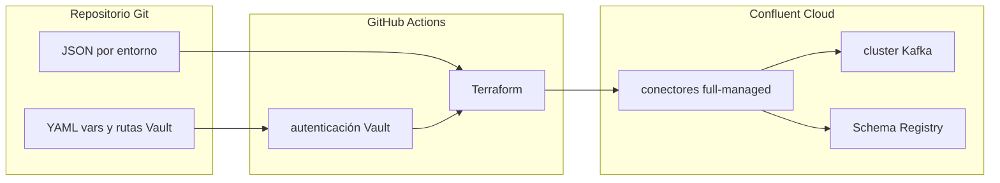

# Presentación: conectores Kafka self-managed y full-managed

Documento para **comunicar valor** (negocio y TI) y **fundamento técnico** del modelo **full-managed** en Confluent Cloud frente al **self-managed** que el banco ya utiliza, y de cómo el **pipeline Git (GitHub Actions + Terraform + Vault)** materializa esa capacidad en la práctica.

---

## Mensaje en una frase

**Self-managed**: el banco opera el motor de integración (Kafka Connect) de punta a punta. **Full-managed**: se opera el **contrato** de la integración (configuración, identidades, topics, esquemas) sobre un **servicio de conectores** que Confluent mantiene; el despliegue queda **industrializado** en Git, con trazabilidad y secretos desde Vault.

---

## Por qué importa (valor)

- **Velocidad**: menos fricción para publicar o ajustar integraciones cuando el trabajo repetitivo de plataforma lo absorbe el servicio administrado.
- **Enfoque del equipo**: las horas dejan de ir a parches, capacidad y “mantener Connect arriba” y pasan a **calidad de datos, contratos y SLAs** con negocio.
- **Gobernanza en un banco**: cambios **revisables en pull request**, historial en Git, separación de secretos (Vault) y menos configuraciones únicas difíciles de auditar.
- **Coherencia con Confluent Cloud**: Kafka, Schema Registry y conectores en el **mismo ecosistema** reducen divergencia operativa y simplifican soporte y documentación.
- **Escala organizacional**: un **estándar por aplicación (CODAPP)** permite que más equipos integren sin multiplicar silos de clusters Connect internos.

---

## Qué es cada modelo (técnico)

### Self-managed

**Kafka Connect** corre en **infraestructura del banco** (VMs, Kubernetes, etc.). El equipo:

- Despliega y actualiza el **runtime** de Connect y los **plugins** (connectors).
- Define **alta disponibilidad** (varios workers), reparto de tareas y recuperación ante fallas.
- Gestiona **almacenamiento interno** de Connect (offsets, configuración, estado según el modo del conector).
- Alinea **red** (firewalls, DNS, TLS), **observabilidad** (métricas, logs, alertas) y **seguridad** (credenciales, rotación) con políticas internas.

En resumen: **quien opera asume el rol de SRE del conector y del cluster Connect**.

### Full-managed (Confluent Cloud)

Confluent expone **conectores administrados** como parte del servicio en la nube: el **plano de control** y la **operación base** del servicio de Connect corren **bajo responsabilidad del proveedor**. El equipo:

- **Define** el **conector** (clase, topics, formato, opciones de errores/DLQ, etc.).
- **Asigna** **identidades** (por ejemplo, Service Accounts) y **permisos** alineados con Kafka y Schema Registry.
- **Versiona** y aplica la configuración mediante **API / Terraform**, no mediante SSH a un cluster propio.

En resumen: **el banco es dueño del contrato de integración y de la gobernanza**; el motor como servicio es **operado por Confluent** en esa capa.

---

## Comparativa técnica directa

| Aspecto | Self-managed | Full-managed (Confluent Cloud) |
|--------|--------------|--------------------------------|
| **Runtime Connect** | Propio (instalación, versión, parches) | Servicio administrado |
| **Alta disponibilidad / workers** | Diseño y operación internos | Cubierto en el modelo de servicio |
| **Actualización de plataforma** | Ventanas de cambio internas | Evolución del servicio en la nube |
| **Definición del conector** | APIs REST Connect / archivos / CI propia | API Confluent + **IaC** (por ejemplo, Terraform) |
| **Secretos** | Patrón interno (vault, otro vault, etc.) | Encaje con **Vault + pipeline** (sin credenciales en el repo) |
| **Observabilidad** | Stack interno obligatorio | Nube + prácticas del proveedor + integraciones propias |
| **Red** | Peering/VPN/firewall hacia orígenes y Kafka | Integración con **red privada / endpoints** según diseño Confluent |

---

## Comparación de costos (marco para el banco)

### Cuadro resumen: self-managed vs full-managed

Cifras **ilustrativas** en **USD/mes** salvo que se indique lo contrario; escenario detallado más abajo. **No** incluyen el **cluster Kafka** ni Schema Registry en el lado Confluent.

| Dimensión | **Self-managed** | **Full-managed (Confluent Cloud)** |
|-----------|------------------|--------------------------------------|
| **Supuestos de la simulación** | **11 sinks** (6 ADLS + 1 Elasticsearch + 3 Salesforce + 1 JDBC), **~25 TB/mes** por conectores, **11 tareas** (`tasks.max` = 1 c/u) | Mismos supuestos |
| **Qué se está comparando** | **Plataforma** Connect propia: cómputo, observabilidad, red, **licencia/soporte** | Solo **uso de conectores gestionados**: **tareas** + **tráfico** (`$/GB` pre-compresión); Kafka ya contratado aparte |
| **Ticket mensual (rango)** | **~700–4 150** (suelo sin licencia; techo con licencia/soporte alto) | **~1 100–1 600** (banda **tarea** min/max del catálogo + **625** de datos a **0,025 $/GB**) |
| **Referencia “punto medio”** | **~1 300–2 500** típico si se imputa **licencia/soporte** medio en banca | **~1 350** (~721 tareas + ~625 datos) |
| **TCO con operación** | **~2 200–8 000** con **0,15–0,25 FTE** plataforma (~10–15 k$/mes-FTE) | Menos **SRE de runtime Connect**; siguen costes de **integración, red a destinos y gobierno** (no cuantificados aquí) |
| **Palanca principal de coste** | **Nodos**, **contrato de licencia**, **headcount** | **Volumen (GB/mes)**, **`tasks.max`**, tipo de conector (p. ej. Salesforce más caro que ADLS) |
| **Quién opera Kafka Connect** | **Organización** (parches, HA, plugins) | **Confluent** en la capa de conector administrado |

**Lectura rápida:** en **solo ticket**, ambos modelos pueden ser **del mismo orden**; el **self-managed** se **dispara** con **licencia + FTE**. El **full-managed** escala sobre todo con **datos y tareas** en factura Confluent.

### Inventario de referencia (ejemplo actual)

Como línea base de capacidad y conversación con FinOps, un patrón cercano al portafolio descrito sería:

| Destino / tipo | Cantidad | Rol |
|----------------|----------|-----|
| **ADLS** (Azure Data Lake / almacenamiento Azure) | 6 | Sink |
| **Elasticsearch** | 1 | Sink |
| **Salesforce** | 3 | Sink |
| **JDBC** | 1 | Sink |
| **Total conectores** | **11** | Todos sink |

El coste variable en **full-managed** depende también de **`tasks.max`** (y del volumen real de datos), no solo del número de conectores: un conector con varias tareas suma más “tareas·hora” que otro con una sola.

### Simulación ilustrativa: volumen alto (solo conectores, orden de magnitud)

> **Aviso:** Cifras **orientativas** para reunión con FinOps. No sustituyen cotización ni modelo interno. Moneda **USD**, precios de **lista pública** según [Managed Kafka Connector Pricing](https://www.confluent.io/confluent-cloud/connect-pricing/) (varían por **región**, **contrato** y descuentos). El tráfico se factura **pre-compresión** (`$/GB`). **No** incluye aquí el coste del **cluster Kafka**, Schema Registry ni cargos de red del banco.

**Supuestos del escenario “considerable”**

| Supuesto | Valor |
|----------|--------|
| Volumen mensual atribuible a estos sinks | **25 TB/mes** (**25 000 GB/mes**) de datos procesados por los conectores |
| Tareas activas | **1 tarea por conector** → **11 tareas** (si `tasks.max` > 1, multiplicar) |
| Horas por mes | **730 h** |
| JDBC | Precio tipo **sink JDBC gestionado** (en la tabla pública se usan conectores como **PostgreSQL / Microsoft SQL Server** sink; si fuera **custom BYOC**, la tarea iría a **0,10–0,20 $/tarea/h** aprox.) |

**Tarifas de lista usadas (punto medio del rango publicado para sinks)**

| Bloque | Conectores (equivalente Confluent Cloud) | $/tarea/h (medio) | Tareas | Coste tareas/mes (730 h) |
|--------|------------------------------------------|-------------------|--------|---------------------------|
| ADLS | [Azure Data Lake Storage Gen2 Sink](https://docs.confluent.io/cloud/current/connectors/cc-azure-datalakeGen2-storage-sink.html) | **0,026** (entre 0,017 y 0,0347) | 6 | 6 × 0,026 × 730 ≈ **114 $** |
| Elasticsearch | [Elasticsearch Sink](https://docs.confluent.io/cloud/current/connectors/cc-elasticsearch-service-sink.html) | **0,078** (entre 0,052 y 0,1041) | 1 | 1 × 0,078 × 730 ≈ **57 $** |
| Salesforce | [Salesforce SObject Sink](https://docs.confluent.io/cloud/current/connectors/cc-salesforce-SObjects-sink.html) | **0,225** (entre 0,15 y 0,30) | 3 | 3 × 0,225 × 730 ≈ **493 $** |
| JDBC | [PostgreSQL Sink](https://docs.confluent.io/cloud/current/connectors/cc-postgresql-sink.html) (proxy de «JDBC gestionado») | **0,078** | 1 | 1 × 0,078 × 730 ≈ **57 $** |
| **Suma tareas** | | | **11** | **~721 $/mes** |

**Tráfico de datos** (misma página: **0,025 $/GB** en la tabla de conectores gestionados):

25 000 GB/mes × **0,025 $/GB** ≈ **625 $/mes**

**Total solo conectores full-managed (lista pública, escenario medio)**

| Partida | USD/mes (aprox.) |
|---------|-------------------|
| Capacidad por tareas | **721** |
| Tráfico (25 TB) | **625** |
| **Subtotal** | **~1 350 $/mes** (**~16 200 $/año**) |

**Banda rápida (mismo volumen, solo cambiando tarea al mínimo/máximo del rango por tipo)**  
Solo la parte de **tareas** puede moverse aprox. entre **~480 $/mes** y **~960 $/mes**; el tráfico **625 $/mes** es el mismo con **0,025 $/GB**. En conjunto, **orden de magnitud ~1 100–1 600 $/mes** solo conectores + volumen, **antes** de descuentos y **sin** cluster dedicado de Connect (+**~203 $/mes** extra si aplica **0,27778 $/h** al cluster dedicado según la misma página) ni **PrivateLink** (+**0,03 $/tarea/h** según documentación citada).

---

**Self-managed (misma escala: 25 TB/mes, orden de magnitud)**

Aquí no hay línea “por GB” de Confluent; el coste es **capacidad + red + licencias/soporte + operación**.

| Partida | Hipótesis ilustrativa | USD/mes (aprox.) |
|---------|------------------------|------------------|
| **Cómputo** | 3–4 workers Connect (VM/K8s tamaño medio cloud) para sostener ~25 TB/mes con picos | **~600–1 000** |
| **Observabilidad, logs, disco** | Métricas, retención | **~100–250** |
| **Red / egress** | Depende si el Kafka es interno o cloud; muy variable | **~0–400** (placeholder) |
| **Licencias y soporte** | En banca suele haber **distribución con soporte** (p. ej. **Confluent Platform** u oferta equivalente), **AMQ**/fabricante o **contrato enterprise**; suele facturarse por **nodo/vCPU/año** o suscripción. **OSS puro** sin soporte externo: **0 $** de licencia (riesgo y política aparte). | **~0** (solo community, poco habitual) a **~400–2 500**/mes amortizado (**orden de magnitud**; el contrato real lo fija Compras) |
| **Subtotal plataforma** | Cómputo + observabilidad + red + licencia/soporte | **~700–4 150 $/mes** (techo con licencia/soporte alto; suelo **~700** solo si licencia **0** y política lo permite) |
| **Operación (TCO)** | Ej. **0,15–0,25 FTE** plataforma a coste cargado **~10–15 k$/mes** por FTE | **~1 500–3 800 $/mes** |

- **Plataforma (infra + licencia/soporte), comparación parcial con la factura Confluent de conectores:** **~0,7–4,2 k$/mes** frente a **~1,1–1,6 k$/mes** de la simulación full-managed *solo conectores + datos*. Con **soporte o stack comercial on-prem**, el self-managed **deja de ser “solo VMs”** y a menudo **iguala o supera** el ticket cloud **antes** de contar FTE.
- **TCO con operación:** self-managed con FTE imputado: **~2,2–8 k$/mes** en este ejemplo (plataforma + fracción FTE), según si la licencia va al suelo (**~2,2 k$**) o al techo (**~8 k$**).

*(Los importes mensuales desglosados coinciden con el [cuadro resumen](#cuadro-resumen-self-managed-vs-full-managed) al inicio de esta sección.)*

Vuelve a calcular con **vuestro** volumen real (GB/mes), **`tasks.max`** y **coste hora interno**; la fórmula Confluent es siempre:

`coste_tareas = suma de (tareas_i × $/tarea/h_i × 730)` y `coste_datos = GB_mes × $/GB`.

### Self-managed: de qué está hecho el coste (TCO)

Aquí el gasto **no** suele aparecer como “línea de conector” en una factura, sino como **capacidad y tiempo de personas**:

- **Infraestructura**: nodos (VM, Kubernetes, etc.) para workers de Connect, almacenamiento y red asociados.
- **Licencias y soporte**: uso de **Confluent Platform** (u otra distribución comercial), **suscripción de soporte** o **acuerdos por núcleo/nodo**; en modelos solo **Apache Kafka/Connect OSS** el coste de licencia es **cero**, pero suele compensarse con **contrato de soporte** o asumir el riesgo operativo.
- **Operación**: parches del runtime, actualización de **plugins**, alta disponibilidad, recuperación ante fallos, ajuste de recursos.
- **Observabilidad y seguridad**: métricas, logs, alertas, hardening, gestión de credenciales y cumplimiento (encaje con políticas del banco).
- **Coste de oportunidad**: horas de equipos de plataforma que dejan de dedicarse a otros riesgos o productos.

Para comparar en serio hace falta un **modelo interno** (coste hora de plataforma, número de FTE imputados, amortización de HW/cloud interno, etc.).

### Full-managed (Confluent Cloud): dimensiones típicas de facturación

En el modelo público de **conectores administrados** en Confluent Cloud, los importes dependen sobre todo de:

- **Uso por tarea y tiempo** (facturación por tarea y hora, según tipo de conector y condiciones del contrato).
- **Tráfico de datos** asociado al conector (p. ej. GB procesados según la definición de facturación del proveedor; suele referirse a datos **descomprimidos**).
- **Opciones añadidas** si aplican: por ejemplo cluster **dedicado** de Connect, **PrivateLink** u otros suplementos descritos en la documentación y la lista de precios.

Los precios **cambian por región, moneda, acuerdo empresarial y promociones**; no sustituyen a una cotización. Referencia oficial: [Managed Kafka Connector Pricing (Confluent)](https://www.confluent.io/confluent-cloud/connect-pricing/) y [Billing overview (Confluent Cloud)](https://docs.confluent.io/cloud/current/billing/overview.html).

### Tabla comparativa (enfoque TCO, no solo “ticket”)

| Dimensión | Self-managed | Full-managed (Confluent Cloud) |
|-----------|--------------|--------------------------------|
| **Visibilidad en factura** | Repartido en cómputo, red, licencias, herramientas y personal | Líneas de uso Confluent (tareas, datos, opciones de red/cluster) **más** el Kafka/entorno ya contratado |
| **Coste marginal de un conector nuevo** | Nuevo consumo de capacidad + posible ampliación de soporte/operación | Sobre todo **tareas activas** y **volumen**; conviene dimensionar `tasks.max` con criterio |
| **Conectores pausados** | Sigue habiendo coste de plataforma subyacente | Sigue habiendo coste de **tareas asignadas** según política de facturación; para dejar de facturar por ese conector suele requerirse **eliminarlo** (confirmar en la guía vigente de billing) |
| **FTE / operación** | Mayor carga en el banco en runtime Connect y plugins | Menor carga en “mantener el motor”; sigue haciendo falta operar **integración, red hacia sistemas destino y gobierno** |

### Cómo usar este apartado con FinOps (orden de trabajo sugerido)

1. **Inventario**: conectores, `tasks.max` medio o máximo, y GB/día (o MB/s) por flujo crítico hacia ADLS, Elasticsearch, Salesforce y JDBC.
2. **Lado self-managed**: coste imputado de **workers + red + herramientas + %FTE** anualizado.
3. **Lado full-managed**: estimación con la **calculadora / pricing** de Confluent y el contrato vigente (no con números genéricos de un documento interno).
4. **Sensibilidad**: escenarios “bajo / medio / alto” de volumen; el coste de conectores administrados suele **escalar con el dato**, no solo con el número de conectores.

Con el ejemplo de **11 sinks**, la pregunta útil no es solo “¿cuánto cuesta uno?”, sino “¿cuántas **tareas** corren en total y cuánto **volumen** mueven?”: ahí es donde convergen self-managed (capacidad a dimensionar) y full-managed (precio por uso declarado por el proveedor).

---

## Cómo se materializa el full-managed en este programa (stack)

Sin entrar en el detalle de cada archivo (eso está en el modelo operativo), la **cadena técnica** es:

1. **Git**: configuración declarativa por conector y entorno (JSON no sensible, YAML por entorno, referencias a secretos en Vault).
2. **GitHub Actions**: orquesta el flujo (checkout, credenciales de Terraform, obtención de secretos del conector, `terraform plan/apply`).
3. **Vault**: almacena credenciales; el pipeline las **lee** y las inyecta como variables sensibles a Terraform (no como texto en el repositorio).
4. **Terraform (provider Confluent)**: converge el estado deseado del recurso `confluent_connector` (config no sensible + sensible, estado del conector, cluster y entorno de Confluent Cloud).

Esto convierte cada cambio de integración en un **cambio de software**: revisable, repetible y auditable.

Referencia de convenciones y estructura: [CONNECTORS_OPERATIONAL_MODEL.md](./CONNECTORS_OPERATIONAL_MODEL.md).

---

## Diagrama mental (flujo de despliegue)

---

## Cierre (pitch)

El banco ya sabe integrar con **Connect propio**. El salto a **full-managed** no es reemplazar el “qué” (se sigue moviendo datos entre sistemas y Kafka), sino **elevar el “cómo”**: menos operación de plataforma, más **estándar cloud**, más **trazabilidad** y un camino claro para que **más equipos** publiquen integraciones bajo el **mismo marco** de seguridad y automatización.

Para profundizar en carpetas, permisos, DLQ y variables por entorno: [CONNECTORS_OPERATIONAL_MODEL.md](./CONNECTORS_OPERATIONAL_MODEL.md).
