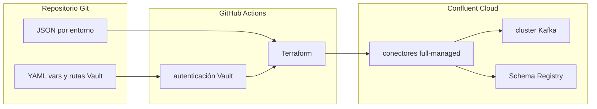

# Presentación: conectores Kafka self-managed y full-managed

Documento para **comunicar valor** (negocio y TI) y **fundamento técnico** del modelo **full-managed** en Confluent Cloud frente al **self-managed** que el banco ya utiliza, y de cómo el **pipeline Git (GitHub Actions + Terraform + Vault)** materializa esa capacidad en la práctica.

---

## Mensaje en una frase

**Self-managed**: el banco opera el motor de integración (Kafka Connect) de punta a punta. **Full-managed**: se opera el **contrato** de la integración (configuración, identidades, topics, esquemas) sobre un **servicio de conectores** que Confluent mantiene; el despliegue queda **industrializado** en Git, con trazabilidad y secretos desde Vault.

---

## Por qué importa (valor)

- **Velocidad**: menos fricción para publicar o ajustar integraciones cuando el trabajo repetitivo de plataforma lo absorbe el servicio administrado.
- **Enfoque del equipo**: las horas dejan de ir a parches, capacidad y “mantener Connect arriba” y pasan a **calidad de datos, contratos y SLAs** con negocio.
- **Gobernanza en un banco**: cambios **revisables en pull request**, historial en Git, separación de secretos (Vault) y menos configuraciones únicas difíciles de auditar.
- **Coherencia con Confluent Cloud**: Kafka, Schema Registry y conectores en el **mismo ecosistema** reducen divergencia operativa y simplifican soporte y documentación.
- **Escala organizacional**: un **estándar por aplicación (CODAPP)** permite que más equipos integren; conviene contrastar con el patrón **un AKS por conector**, que **multiplica** silos operativos y coste fijo por clúster.

---

## Qué es cada modelo (técnico)

### Self-managed

**Kafka Connect** corre en **infraestructura del banco** (VMs, Kubernetes, etc.). En el modelo actual que se usa como referencia, **cada conector vive en un clúster AKS distinto** (aislamiento por integración). El equipo:

- Despliega y actualiza el **runtime** de Connect y los **plugins** (connectors) **en cada AKS** (plantillas, versiones y ventanas de cambio **multiplicadas**).
- Define **alta disponibilidad** (varios workers), reparto de tareas y recuperación ante fallas.
- Gestiona **almacenamiento interno** de Connect (offsets, configuración, estado según el modo del conector).
- Alinea **red** (firewalls, DNS, TLS), **observabilidad** (métricas, logs, alertas) y **seguridad** (credenciales, rotación) con políticas internas.

En resumen: **quien opera asume el rol de SRE del conector y del cluster Connect**.

### Full-managed (Confluent Cloud)

Confluent expone **conectores administrados** como parte del servicio en la nube: el **plano de control** y la **operación base** del servicio de Connect corren **bajo responsabilidad del proveedor**. El equipo:

- **Define** el **conector** (clase, topics, formato, opciones de errores/DLQ, etc.).
- **Asigna** **identidades** (por ejemplo, Service Accounts) y **permisos** alineados con Kafka y Schema Registry.
- **Versiona** y aplica la configuración mediante **API / Terraform**, no mediante SSH a un cluster propio.

En resumen: **el banco es dueño del contrato de integración y de la gobernanza**; el motor como servicio es **operado por Confluent** en esa capa.

---

## Comparativa técnica directa

| Aspecto | Self-managed | Full-managed (Confluent Cloud) |
|--------|--------------|--------------------------------|
| **Runtime Connect** | Propio (instalación, versión, parches) | Servicio administrado |
| **Alta disponibilidad / workers** | Diseño y operación internos | Cubierto en el modelo de servicio |
| **Actualización de plataforma** | Ventanas de cambio internas | Evolución del servicio en la nube |
| **Definición del conector** | APIs REST Connect / archivos / CI propia | API Confluent + **IaC** (por ejemplo, Terraform) |
| **Secretos** | Patrón interno (vault, otro vault, etc.) | Encaje con **Vault + pipeline** (sin credenciales en el repo) |
| **Observabilidad** | Stack interno obligatorio | Nube + prácticas del proveedor + integraciones propias |
| **Red** | Peering/VPN/firewall hacia orígenes y Kafka | Integración con **red privada / endpoints** según diseño Confluent |
| **Topología / tenancy** | **Un AKS por conector** (varios clústeres que operar) | Sin **N** clústeres AKS en el banco para esos conectores; capacidad de Connect en el **servicio** |

---

## Comparación de costos (marco para el banco)

Escenario modelado: **un único sink Azure Data Lake Storage Gen2 (ADLS)**; **`tasks.max` = 3**; **dos workers** de Kafka Connect y **un clúster AKS** en self-managed. Volumen **considerable** = **~15 TB/mes** (**15 000 GB/mes**) hacia ADLS (criterio Confluent **pre-compresión** para `$/GB`). **USD/mes**, lista pública / orden de magnitud Azure; **sin** precio de cluster Kafka ni Schema Registry en Confluent.

### Cuadro resumen: self-managed vs full-managed *(1 conector ADLS)*

| Dimensión | **Self-managed** | **Full-managed (Confluent Cloud)** |
|-----------|------------------|--------------------------------------|
| **Conector** | 1× sink **ADLS Gen2** | Mismo conector administrado |
| **Paralelismo** | **3 tareas**, **2 workers**, **1 AKS** | **3 tareas** facturables |
| **Volumen** | **~15 TB/mes** | **15 000 GB × 0,025 $/GB ≈ 375 $/mes** (tráfico) |
| **Qué se compara** | **1 AKS** + nodos, observabilidad, red, licencia/soporte | **$/tarea·h** + **$/GB** (solo uso del conector) |
| **Ticket (rango)** | **~320–1 400** | **~287–576** *(tareas al min/max del catálogo + volumen **10–20 TB**)* |
| **Estimación central** | **~720** | **~432** *(~57 $ tareas + 375 $ datos)* |
| **+ FTE** | **+300–1 200** → total **~1 020–1 920** *(~0,03–0,1 FTE @ ~10–15 k$/mes)* | Menos SRE de Connect *(no se suma el mismo FTE)* |

**Más económico (caso central):** **full-managed** (**~432 $/mes** vs **~720 $/mes**), **~40 %** de reducción sobre la plataforma modelada; con **FTE**, el ahorro **relativo** suele **subir**.

### Cuadro final de comparación (montos USD/mes)

| Concepto | **Self-managed** | **Full-managed** |
|----------|------------------:|-----------------:|
| **Mínimo** (banda) | **~320** | **~287** |
| **Máximo** (banda) | **~1 400** | **~576** |
| **Central** | **~720** | **~432** |
| **Central + FTE** | **~1 020–1 920** | — |

### Lámina: ahorro *(1 ADLS, 3 tareas, 2 workers, 1 AKS, ~15 TB/mes)*

**Qué comparamos:** costo de **Connect en 1 AKS (2 workers)** vs **mismo sink ADLS full-managed**. **No** incluye Kafka en Confluent ni presupuesto total TI.

**Reducción %** = (costo hoy − costo full) / costo hoy.

| **Escenario** | **Costo hoy** *(USD/mes)* | **Full-managed** *(USD/mes)* | **Ahorro** *(USD/mes)* | **Ahorro** *(%)* |
|---------------|---------------------------:|-----------------------------:|----------------------:|-----------------:|
| **Típico** | ~720 | ~432 | ~288 | **~40 %** |
| **Típico + FTE** *(punto medio ~1 200 vs 432)* | ~1 200 | ~432 | ~768 | **~64 %** |

### Inventario del escenario modelado

| Concepto | Valor |
|----------|--------|
| Conector | **Azure Data Lake Storage Gen2** sink |
| `tasks.max` | **3** |
| Workers (self-managed) | **2** en **1 AKS** |
| Volumen | **~15 TB/mes** *(ajustar en FinOps)* |

### Simulación ilustrativa: full-managed *(detalle)*

> **Aviso:** Orientativo; [precios Confluent Connect](https://www.confluent.io/confluent-cloud/connect-pricing/).

**Tareas** — [ADLS Gen2 Sink](https://docs.confluent.io/cloud/current/connectors/cc-azure-datalakeGen2-storage-sink.html): **0,017–0,0347 $/tarea/h**; punto medio **~0,026 $/tarea/h**; **730 h/mes**:

- **3 × 0,026 × 730 ≈ 57 $/mes** (banda **~37–76 $/mes**).

**Datos:** **15 000 GB × 0,025 $/GB = 375 $/mes**.

| Partida | USD/mes (aprox.) |
|---------|-----------------:|
| Capacidad por tareas (3) | **~57** |
| Tráfico (15 TB) | **375** |
| **Total conector** | **~432** |

### Self-managed *(detalle: 1 AKS, 2 workers)*

| Partida | Hipótesis | USD/mes (aprox.) |
|---------|-----------|-----------------:|
| **AKS + nodos** | 1 clúster, pool para **2 workers**, discos | **~250–800** |
| **Observabilidad / logs** | Métricas, retención | **~40–150** |
| **Red / egress** | Hacia ADLS y Kafka | **~30–120** |
| **Licencias y soporte** | Comercial u OSS según política | **~0–330** |
| **Subtotal** | | **~320–1 400** |
| **FTE** *(0,03–0,1 FTE)* | Operar AKS + Connect | **~300–1 200** |

`coste_tareas = tareas × $/tarea/h × 730`; `coste_datos = GB_mes × $/GB`.

### Self-managed: de qué está hecho el coste (TCO)

Aquí el gasto **no** suele aparecer como “línea de conector” en una factura, sino como **capacidad y tiempo de personas**:

- **Infraestructura**: la simulación de costes de arriba usa **un AKS con 2 workers** para **un** sink ADLS; en otras topologías del banco (p. ej. **un AKS por conector**) el **coste fijo por clúster** se **multiplica** con el número de integraciones.
- **Licencias y soporte**: uso de **Confluent Platform** (u otra distribución comercial), **suscripción de soporte** o **acuerdos por núcleo/nodo**; en modelos solo **Apache Kafka/Connect OSS** el coste de licencia es **cero**, pero suele compensarse con **contrato de soporte** o asumir el riesgo operativo.
- **Operación**: parches del runtime, actualización de **plugins**, alta disponibilidad, recuperación ante fallos, ajuste de recursos.
- **Observabilidad y seguridad**: métricas, logs, alertas, hardening, gestión de credenciales y cumplimiento (encaje con políticas del banco).
- **Coste de oportunidad**: horas de equipos de plataforma que dejan de dedicarse a otros riesgos o productos.

Para comparar en serio hace falta un **modelo interno** (coste hora de plataforma, número de FTE imputados, amortización de HW/cloud interno, etc.).

### Full-managed (Confluent Cloud): dimensiones típicas de facturación

En el modelo público de **conectores administrados** en Confluent Cloud, los importes dependen sobre todo de:

- **Uso por tarea y tiempo** (facturación por tarea y hora, según tipo de conector y condiciones del contrato).
- **Tráfico de datos** asociado al conector (p. ej. GB procesados según la definición de facturación del proveedor; suele referirse a datos **descomprimidos**).
- **Opciones añadidas** si aplican: por ejemplo cluster **dedicado** de Connect, **PrivateLink** u otros suplementos descritos en la documentación y la lista de precios.

Los precios **cambian por región, moneda, acuerdo empresarial y promociones**; no sustituyen a una cotización. Referencia oficial: [Managed Kafka Connector Pricing (Confluent)](https://www.confluent.io/confluent-cloud/connect-pricing/) y [Billing overview (Confluent Cloud)](https://docs.confluent.io/cloud/current/billing/overview.html).

### Tabla comparativa (enfoque TCO, no solo “ticket”)

| Dimensión | Self-managed | Full-managed (Confluent Cloud) |
|-----------|--------------|--------------------------------|
| **Visibilidad en factura** | Repartido en cómputo, red, licencias, herramientas y personal | Líneas de uso Confluent (tareas, datos, opciones de red/cluster) **más** el Kafka/entorno ya contratado |
| **Coste marginal de un conector nuevo** | Nuevo consumo de capacidad + posible ampliación de soporte/operación | Sobre todo **tareas activas** y **volumen**; conviene dimensionar `tasks.max` con criterio |
| **Conectores pausados** | Sigue habiendo coste de plataforma subyacente | Sigue habiendo coste de **tareas asignadas** según política de facturación; para dejar de facturar por ese conector suele requerirse **eliminarlo** (confirmar en la guía vigente de billing) |
| **FTE / operación** | Mayor carga en el banco en runtime Connect y plugins | Menor carga en “mantener el motor”; sigue haciendo falta operar **integración, red hacia sistemas destino y gobierno** |

### Cómo usar este apartado con FinOps (orden de trabajo sugerido)

1. **Inventario**: por conector crítico (aquí: **ADLS Gen2 sink**), `tasks.max` efectivo y GB/día (o MB/s); repetir el mismo patrón para otros destinos si hace falta un agregado.
2. **Lado self-managed**: coste imputado del **AKS** que aloja ese Connect (o suma de clústeres si hay **un AKS por conector**), **licencia**, red, observabilidad y **%FTE** anualizado.
3. **Lado full-managed**: estimación con la **calculadora / pricing** de Confluent y el contrato vigente (no con números genéricos de un documento interno).
4. **Sensibilidad**: escenarios “bajo / medio / alto” de volumen; el coste de conectores administrados suele **escalar con el dato**, no solo con el número de conectores.

Con el ejemplo de **un sink ADLS de volumen considerable** (`tasks.max` 3, **~15 TB/mes**), la pregunta útil no es solo “¿cuánto cuesta el clúster?”, sino “¿cuántas **tareas** corren y cuánto **volumen** mueven?”: ahí es donde convergen self-managed (capacidad a dimensionar) y full-managed (precio por uso declarado por el proveedor).

---

## Cómo se materializa el full-managed en este programa (stack)

Sin entrar en el detalle de cada archivo (eso está en el modelo operativo), la **cadena técnica** es:

1. **Git**: configuración declarativa por conector y entorno (JSON no sensible, YAML por entorno, referencias a secretos en Vault).
2. **GitHub Actions**: orquesta el flujo (checkout, credenciales de Terraform, obtención de secretos del conector, `terraform plan/apply`).
3. **Vault**: almacena credenciales; el pipeline las **lee** y las inyecta como variables sensibles a Terraform (no como texto en el repositorio).
4. **Terraform (provider Confluent)**: converge el estado deseado del recurso `confluent_connector` (config no sensible + sensible, estado del conector, cluster y entorno de Confluent Cloud).

Esto convierte cada cambio de integración en un **cambio de software**: revisable, repetible y auditable.

Referencia de convenciones y estructura: [CONNECTORS_OPERATIONAL_MODEL.md](./CONNECTORS_OPERATIONAL_MODEL.md).

---

## Diagrama mental (flujo de despliegue)

---

## Cierre (pitch)

El banco ya sabe integrar con **Connect propio**. El salto a **full-managed** no es reemplazar el “qué” (se sigue moviendo datos entre sistemas y Kafka), sino **elevar el “cómo”**: menos operación de plataforma, más **estándar cloud**, más **trazabilidad** y un camino claro para que **más equipos** publiquen integraciones bajo el **mismo marco** de seguridad y automatización.

Para profundizar en carpetas, permisos, DLQ y variables por entorno: [CONNECTORS_OPERATIONAL_MODEL.md](./CONNECTORS_OPERATIONAL_MODEL.md).
