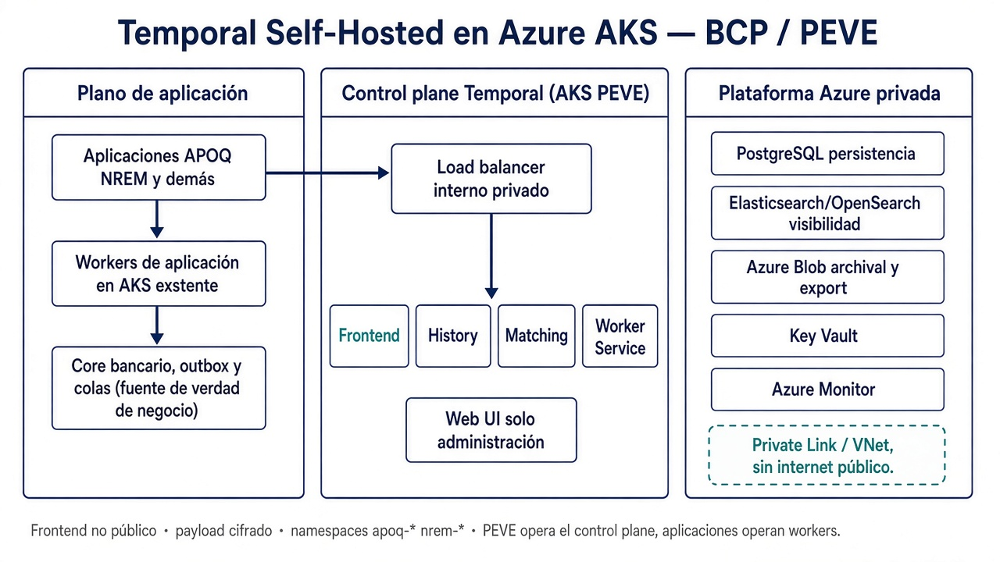
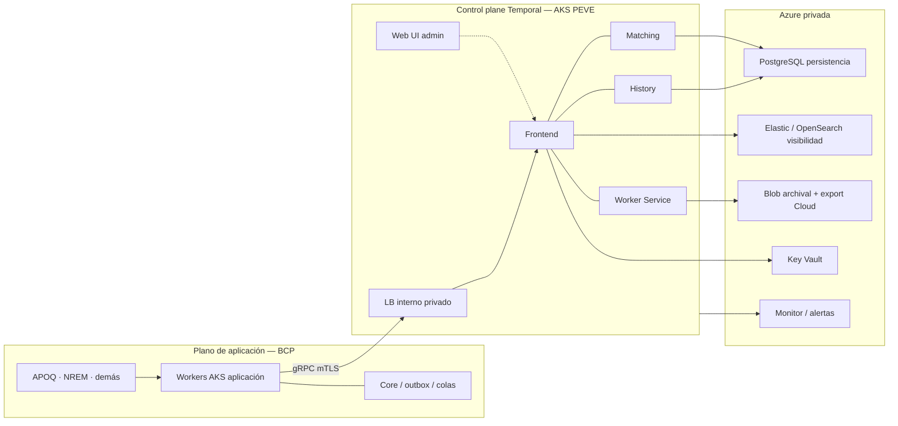
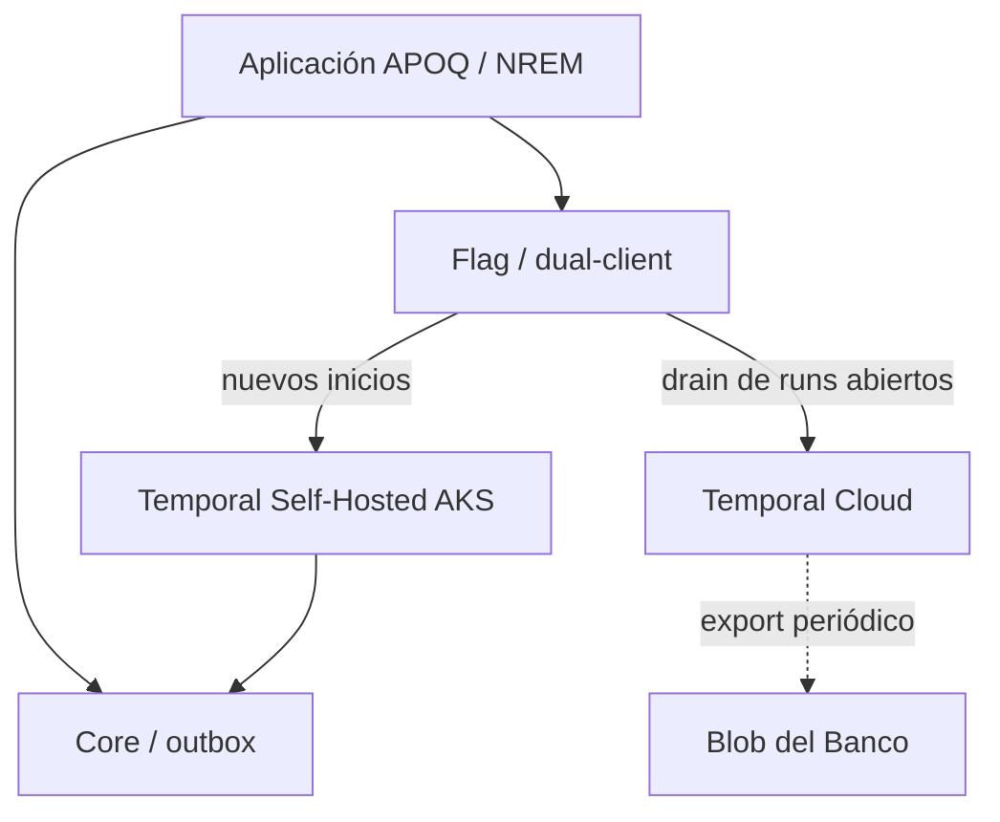
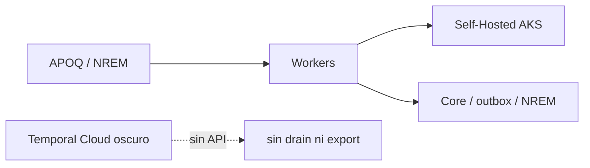

# Plan de retiro preventivo de Temporal Cloud ante insolvencia del proveedor

**BCP · PEVE · Versión 1.0 final**  
Datos elaborados por BCP para uso interno.  
Resumen para la instancia aprobadora: `plan-retiro-temporal-cloud-resumen-aprobacion.md`.

| Control | Valor |
|---|---|
| Código | PEVE-EXIT-TEMPORAL-CLOUD-01 |
| Versión | 1.0 |
| Estado | Final para aprobación (fase 0 pendiente de ejecución) |
| Clasificación | Uso interno BCP |
| Dueño | PEVE |
| Revisores | Arquitectura, Seguridad, Continuidad, RNF, Legal / Compras, PO APOQ, PO NREM |
| Aprobador | Instancia aprobadora |
| Vigencia | Hasta la siguiente revisión anual o cambio material |
| Relacionado | BCM/DR de Cloud (fuera de este plan); receta de despliegue de cada aplicación |

Esta versión cierra el marco, la arquitectura objetivo, el playbook y los anexos. Los campos en cursiva de los anexos A, C, F y G son datos operativos que no fabrica el plan: se completan en la ejecución de la fase 0, no en una nueva redacción.

---

## Ficha del documento

| Campo | Contenido |
|---|---|
| Servicio ICT | Temporal Cloud (SaaS de orquestación y persistencia de estado de workflows) |
| Proveedor | Temporal Technologies Inc. |
| Función | Crítica / servicio significativo de procesamiento de datos |
| Destino | Temporal Self-Hosted en Azure AKS del Banco |
| Riesgo cubierto | Insolvencia, liquidación, cese de operaciones o pérdida material de capacidad del proveedor para operar Temporal Cloud |
| Fuera de alcance | Terminación comercial, renegociación de precio, cambio de producto o alternativas distintas a Self-Hosted, salvo aprobación formal |
| Gobierno | PEVE gobierna el plan y entrega la receta técnica. Los equipos de aplicación ejecutan y validan su migración. |
| Naturaleza | Preventivo y activable. Prepara la alternativa ahora; se ejecuta cuando se declara going-concern o cese del SaaS. |

**Posición del Banco.** Temporal Cloud es el activo perecedero. El servidor Temporal (open source, licencia MIT) es el activo portable. El Banco no depende de la solvencia de Temporal Technologies Inc. para orquestar: la orquestación continúa en el mismo motor, operado por el Banco, con historiales y estado de negocio fuera del proveedor.

Los workers ya se ejecutan en AKS del Banco. El cambio material es de **control plane y conexión**, no de cómputo de aplicación.

---

## Principios

1. **Continuidad y exactly-once.** No se admite doble ejecución de side effects (débito/crédito, remesa, liquidación). Las activities deben ser idempotentes. Un schedule o workflow no puede estar activo a la vez en Cloud y en Self-Hosted.
2. **Self-Hosted en Azure AKS es la única alternativa.** No se busca otro SaaS el día D.
3. **Preparar antes de activar.** La plataforma objetivo, la receta, el inventario y el export de historiales existen *antes* de la notificación del proveedor.
4. **Dos modos, no uno.** En reorganización o venta puede haber ventana y drain controlado. En liquidación o apagón no hay cooperación: se hace failover y se reconstruye desde el estado de negocio.
5. **Migración por ambientes.** Desarrollo → certificación → producción. No hay pase productivo sin conformidad técnica, funcional y de seguridad.
6. **Responsabilidad distribuida.** PEVE estandariza y consolida. Cada aplicación inventaría, migra, concilia y evidencia.
7. **No apagar Cloud mientras haya estado sin tratar**, salvo que Cloud ya no responda. En ese caso rige el modo estresado.
8. **Evidencia completa.** Técnica, funcional, de continuidad, datos, seguridad, contractual y de riesgo.

---

## 01. Identificación y criticidad

Temporal Cloud soporta la orquestación y la persistencia del estado de workflows de aplicaciones del BCP. Al ser un servicio gestionado, su continuidad depende de la estabilidad operativa, financiera y contractual de Temporal Technologies Inc.

El retiro cubre todas las aplicaciones del BCP que usan o tienen previsto usar Temporal Cloud, en ambientes productivos y no productivos, hasta que no quede ninguna dependencia activa del Banco en el SaaS.

**Incluye:** aplicaciones, workflows (activos, históricos, fallidos, compensados, en reproceso), namespaces, workers en AKS, endpoints, red, certificados, secretos, pipelines, observabilidad, pruebas, aprobaciones y evidencias de cierre.

**No incluye:** aplicaciones de empresas distintas a BCP; cambios funcionales innecesarios para el retiro; otra tecnología distinta a Temporal Self-Hosted en Azure AKS, salvo aprobación formal; el detalle de despliegue de cada aplicación (queda en sus procedimientos, aplicando la receta PEVE).

### Inventario

| Aplicación | Proceso | Ambiente | Prioridad | Tratamiento |
|---|---|---|---|---|
| APOQ | Transferencias entre cuentas: débito, crédito, compensación y recuperación ante fallos | Producción | Alta | Migración controlada a Self-Hosted |
| NREM | Gestión de remesas, emisión y recepción | Producción | Alta | Migración controlada a Self-Hosted |
| CPCA | Capa Producto Cuenta Ahorros del Nuevo Autorizador | Dev / cert | Antes de producción | Migrar o retirar |
| CPCC | Capa Producto Cuenta Corriente del Nuevo Autorizador | Dev / cert | Antes de producción | Migrar o retirar |
| APTI / TUPI | Pagos y transferencias digitales de alto volumen | Dev / cert | Antes de producción | Migrar o retirar |
| CDPT | Capa de negocio para pagos y transferencias | Dev / cert | Antes de producción | Migrar o retirar |
| SRCR | Tracking de pagos y renovación tecnológica | Dev / cert | Antes de producción | Migrar o retirar |
| LBCL | Transferencias interbancarias BCR y liquidación en LBTR | Dev / cert | Antes de producción | Migrar o retirar |
| CPCR | Nuevo Core de Cuentas | Dev / cert | Antes de producción | Migrar o retirar |

APOQ y NREM avanzan como frentes paralelos: no se ha identificado dependencia técnica o funcional entre ambas. Cada una cumple por separado preparación, pruebas, aprobación y cierre.

Las no productivas migran a Self-Hosted **antes** de cualquier pase a producción. Si el dueño decide no continuar, se congelan o retiran con evidencia. No se abre producción nueva sobre Temporal Cloud.

**Patrón de namespaces.** `{app}-{ambiente}` en minúsculas, p. ej. `apoq-dev`, `apoq-cert`, `apoq-prod`. El inventario operativo mantiene la correspondencia real Cloud ↔ Self-Hosted.

**Clasificación.** APOQ y NREM son funciones críticas en producción (transferencias y remesas). El resto es material por el tipo de proceso (autorizador, pagos, LBTR, core de cuentas) aunque aún no esté en producción: no deben nacer sobre un SaaS en watch de going-concern.

---

## 02. Objetivos

**General.** Retirar Temporal Cloud del BCP y operar los casos de uso en Temporal Self-Hosted en Azure AKS, sin interrumpir indebidamente los procesos productivos, sin incumplir controles regulatorios y sin dañar la calidad del servicio al cliente.

**Específicos**

- Mantener inventario vivo de aplicaciones, workflows, namespaces, workers y dependencias.
- Tener plataforma objetivo y receta listas *antes* de la activación.
- Declarar disparadores de going-concern y acciones inmediatas.
- Preservar continuidad, integridad, trazabilidad e historiales exigibles.
- Impedir dual-run de efectos de negocio.
- Cerrar accesos, secretos y contrato con evidencia.
- Criterios explícitos de entrada a producción y de cierre del retiro.

Esto cubre las tres garantías exigibles a un exit plan de función crítica: salida sin interrupción indebida, sin limitar el cumplimiento normativo y sin detrimento de la continuidad y calidad del servicio al cliente.

---

## 03. Escenarios y supuestos

El riesgo cubierto es el **going-concern del proveedor**, no un incidente técnico de Cloud (eso es BCM/DR). El plan modela tres desenlaces de insolvencia. El P&L en rojo del proveedor es contexto de vigilancia, no el gatillo.

| Desenlace | Qué ocurre con Cloud | Actuación del Banco | Cooperación del vendor | Horizonte |
|---|---|---|---|---|
| Reorganización concursal | Suele seguir operando. El contrato puede asumirse o rechazarse | Activar el plan, congelar lo nuevo en Cloud, cutover por ambientes | Residual; no depender de professional services | Semanas |
| Venta o change of control | Cloud sigue; cambia el dueño (precio, jurisdicción, roadmap) | Misma ruta técnica. Evaluar si el comprador es aceptable | Alta a media | Semanas a meses |
| Liquidación o cese abrupto | El control plane puede apagarse. Sin export, sin tickets | Failover a Self-Hosted. Reabrir críticos desde estado de negocio | Nula | Horas a pocos días |

### Supuestos razonables

- Temporal Server y SDKs siguen disponibles como open source. El Banco puede operar el mismo motor.
- No existe migración oficial Cloud → Self-Hosted. La salida es a nivel de aplicación (cambio de endpoint / dual-client), no dump de base de datos.
- History Export de Cloud requiere el SaaS vivo y corre de forma periódica. Si no está aterrizado en storage del Banco **antes** del día D, el historial vivo se pierde.
- Temporal orquesta; no es el libro mayor. El RPO del modo estresado es el estado de negocio (core, outbox, colas, conciliaciones de APOQ/NREM), no el event history en Cloud.
- Los workers ya corren en AKS del Banco. El payload hacia Temporal viaja cifrado.
- En liquidación no hay periodo de transición contractual efectivo.

### Lo que el plan no cubre

Caída transitoria de región, degradación corta o incidente de seguridad del SaaS: se tratan en BCM/DR. Si el incidente se convierte en cese material, se declara el escenario de este plan.

---

## 04. Solución alternativa y arquitectura objetivo

**Única ruta aprobada:** Temporal Self-Hosted en Azure AKS, operado por el Banco. PEVE opera el control plane. Las aplicaciones siguen operando sus workers. No se improvisará otra plataforma el día de la activación.

Arquitectura emite conformidad del patrón. Seguridad valida autenticación, autorización, certificados, cifrado, red, logging y segregación.

### 04.1 Diagrama de la propuesta

Tres planos, sin exposición pública del Frontend:

1. **Aplicación (BCP).** APOQ, NREM y el resto. Workers ya en AKS del Banco. Core, outbox y colas son la fuente de verdad de negocio.
2. **Control plane Temporal (AKS PEVE).** Frontend, History, Matching y Worker Service detrás de un load balancer interno. Web UI solo para administración.
3. **Plataforma Azure privada.** Persistencia, visibilidad, archival, secretos y monitoreo por Private Link / VNet.

### 04.2 Decisiones de diseño

| Decisión | Propuesta | Motivo |
|---|---|---|
| Dónde vive Temporal Server | AKS dedicado PEVE, no dentro del namespace de la aplicación | Segregar operación de plataforma y de negocio |
| Cuántos footprints | Dos: no-prod (dev+cert) y prod | Aislar producción; ensayar receta sin tocar críticos |
| Persistencia | Azure Database for PostgreSQL (Flexible Server), HA, backup | Store soportado por Temporal; operación Azure ya conocida |
| Visibilidad | Elasticsearch u OpenSearch en Azure | Búsqueda de workflows en operación y auditoría |
| Archival | Azure Blob (historiales cerrados) | Sobrevive a retención del cluster y a un cese de Cloud |
| Export Cloud | Job a Blob del Banco, mientras Cloud viva | El día D solo existe lo ya copiado |
| Entrada al Frontend | Load balancer interno + Private Link. Sin IP pública | Superficie de ataque y residencia |
| Autenticación | mTLS (o equivalente aprobado) + identidades en Key Vault | No reutilizar API keys de Cloud |
| Workers de aplicación | Permanecen en el AKS actual | El cambio es de endpoint, no de cómputo |
| Payload | Sigue cifrado en tránsito y en el payload de negocio | Control ya declarado por el Banco |
| Namespaces | `{app}-{ambiente}` en cada footprint | Segregación apoq-prod, nrem-prod, etc. |
| DR del control plane | Backup/restore ensayado; segunda zona de disponibilidad en prod | Distinto del exit: esto es BCM del Self-Hosted |
| Qué no se construye | Réplica oficial Cloud → Self-Hosted; dump de la DB de Cloud | No existe en el producto |

Shards, versión de Temporal Server y sizing de nodos los fija PEVE en el Anexo B (dato operativo, no de este marco).

### 04.3 Tratamiento por componente

| Componente | Tratamiento |
|---|---|
| Control plane | Cluster Self-Hosted en AKS (HA, backup, restore, observabilidad, IAM) |
| Workers | Siguen en AKS del Banco; cambian endpoint, credenciales, certificados y parámetros |
| Namespaces | Equivalentes por aplicación y ambiente |
| Identidad y secretos | Accesos nuevos en Self-Hosted; revocación de Cloud al cierre |
| Red | Resolución, rutas, puertos, ILB, Private Link |
| Pipelines | Variables por ambiente; cambio trazable |
| Observabilidad | Logs, métricas, trazas, alertas y tableros sobre Self-Hosted |
| Historiales cerrados | Archival Blob + export Cloud → Blob |
| Operación | Runbook de incidente, restore, upgrade y escalamiento PEVE |

### 04.4 Arquitectura de transición (dual-client)

Mientras Cloud responda, el worker habla un solo cluster activo por workflow. El flag decide el destino de **nuevos** inicios. La reversa solo existe en este modo.

Regla: un `WorkflowId` o un schedule no está activo en Cloud y en Self-Hosted a la vez. Kill-switch: si Self-Hosted no cumple, los **nuevos** inicios vuelven a Cloud solo si Cloud sigue operable.

### 04.5 Arquitectura de failover estresado

Si Cloud no responde, no hay dual-client ni export. Los workers apuntan solo a Self-Hosted. Los runs abiertos en Cloud se dan por no recuperables como historial; se reconstruyen desde el core.

---

## 05. Análisis de impacto

El impacto se concentra en APOQ y NREM. El resto no debe entrar a producción sobre Cloud.

| Aplicación | Proceso | Qué se pierde si Cloud cesa sin standby | Control |
|---|---|---|---|
| APOQ | Transferencias entre cuentas | Workflows de débito/crédito/compensación a medias; riesgo de duplicar o perder un lado de la operación | Dual-client, idempotencia, conciliación, reversa; restart desde estado de negocio en modo estresado |
| NREM | Remesas emisión/recepción | Remesas en curso sin orquestación; riesgo de doble emisión o pérdida de tracking | Igual que APOQ, con conciliación de remesas |
| No productivas | Autorizador, pagos, LBTR, core | No hay impacto de cliente; hay riesgo de nacer atadas a Cloud | Migrar o congelar antes de producción |

**Datos que cada aplicación debe tener actualizados** (PO + Continuidad + equipo técnico): tiempo máximo de recuperación aceptable, pérdida máxima de información aceptable, ventana operativa, volumen típico de workflows, duración (cortos vs largos), schedules, side effects no reversibles y dueño.

**Costo y recursos a estimar en el anexo de seguimiento:** capacidad AKS Self-Hosted (no prod + prod), esfuerzo de dual-client por aplicación, dual-run transitorio, export/retención de historiales, prueba anual de failover, y personal PEVE / aplicación / seguridad. El calendario de salida ordenada debe ser compatible con cualquier *notice period* residual; el de liquidación no lo será — de ahí el standby previo.

APOQ y NREM no se bloquean entre sí. El avance a la siguiente fase es por aplicación, con evidencias propias.

---

## 06. Disparadores

La notificación formal del proveedor es **un** disparador, no el único. En insolvencia, esperar el aviso puede ser esperar el apagón.

| Señal | Umbral | Acción | Quién declara |
|---|---|---|---|
| Notificación formal de Temporal Technologies Inc. | Insolvencia, liquidación, disolución, cese, terminación o imposibilidad material de seguir prestando Cloud | Activación inmediata del plan | Instancia aprobadora, con evidencia custodiada por Legal |
| Comunicación contractual que anticipe pérdida definitiva de capacidad | Notice de sunset, rechazo de contrato en concurso, impago de su propia infraestructura | Activación inmediata | Legal / Compras + instancia aprobadora |
| Going-concern del proveedor | Duda sustancial de auditor, default, covenant breach, o imposibilidad acreditada de operar Cloud | Activación. Congelar onboarding Cloud | RNF + Legal + instancia aprobadora |
| Liquidez / runway | Runway corto sin ronda comprometida, o ronda abortada con recorte operativo material | Watch formal. Dual-client en un namespace. Acelerar standby | RNF + PEVE |
| Colapso operativo de Cloud | Incidentes P1 reiterados o SLA mensual roto atribuible a degradación del vendor | Tratar como proxy de cese. Cutover de críticos | PEVE + Continuidad + instancia aprobadora |
| Change of control | Fusión, venta o cambio de jurisdicción del proveedor o de sus datos | Watch. Misma ruta técnica si el comprador no es aceptable | Legal + Arquitectura + instancia aprobadora |

**Watch** no es activación: es congelar nuevos usos productivos de Cloud, completar inventario, ejercitar la receta en no productivo y tener el cluster listo. **Activación** abre el calendario de cutover y el seguimiento ejecutivo.

### Acciones inmediatas al activar

1. Registrar y custodiar la comunicación o el expediente de going-concern.
2. Convocar PEVE, aplicaciones, Arquitectura, Continuidad, RNF, Seguridad, Legal y Compras/Contratos.
3. Confirmar si Cloud sigue usable y cuánta ventana residual hay (puede ser cero).
4. Congelar despliegues productivos nuevos sobre Temporal Cloud, salvo excepción aprobada.
5. Actualizar inventario de aplicaciones, workflows, namespaces, workers, datos de estado y accesos.
6. Priorizar APOQ y NREM; calendarizar el resto (migrar o congelar).
7. Abrir seguimiento ejecutivo, control de riesgos y paquete de evidencias.
8. No eliminar configuraciones ni accesos Cloud mientras exista estado por tratar **y** Cloud responda.

---

## 07. Gobierno y roles

| Rol | Responsabilidad | Resultado |
|---|---|---|
| Instancia aprobadora | Autorizar watch, activación, excepciones, producción y cierre | Decisiones formalizadas |
| PEVE | Gobernar, priorizar, receta técnica, consolidar evidencias, mantener el plan | Seguimiento único y cierre controlado |
| Coordinación técnica | Articular frentes, bloqueos y avance | Ejecución coordinada |
| Equipos de aplicación | Inventariar, configurar, migrar, probar, conciliar y evidenciar | Aplicación estable en Self-Hosted |
| PO / responsable funcional | Impacto, continuidad, conciliación y aceptación | Conformidad funcional |
| Arquitectura | Arquitectura objetivo y patrones | Conformidad arquitectónica |
| Seguridad / Ciberseguridad | Accesos, red, certificados, cifrado, logging, cierre seguro | Conformidad de seguridad |
| Continuidad | RTO/RPO, ventana, contingencia del modo estresado | Criterios de continuidad aprobados |
| RNF | Tratamiento del riesgo y evidencias | Riesgo tratado y trazable |
| Legal / Compras | Notificaciones, derechos de salida, terminación | Cierre contractual sustentado |

PEVE lleva un seguimiento único: aplicación, ambiente, fase, riesgo, bloqueo, responsable y evidencia. Los bloqueos que comprometan continuidad, seguridad o la ventana de salida se elevan a la instancia aprobadora.

El PO valida impacto y continuidad. El equipo técnico identifica workflows, workers, dependencias y datos de estado, ejecuta y conserva evidencias. PEVE acompaña y estandariza.

---

## 08. Contrato y periodo de transición

Legal y Compras gestionan notificaciones, derechos de salida y terminación. Conservan comunicaciones y constancia de cierre.

El contrato es **útil en reorganización y venta** (notice, asistencia, export, periodo de transición). Es **insuficiente en liquidación**: el proveedor puede no prestar asistencia ni mantener el control plane. Por eso el control principal del plan no es la cláusula, sino el standby técnico.

Mientras Cloud exista como contraparte:

- Custodiar el aviso y la ventana residual, si la hay.
- Exigir asistencia de salida y acceso a historiales solo si el proveedor aún opera.
- No pactar un calendario de salida más largo que la capacidad real de Self-Hosted.
- Al cierre: terminación, evidencia de que no quedan dependencias y, si hay entidad subsistente, constancia de destrucción o indisponibilidad de datos del Banco en Cloud.

La destrucción certificada de datos en Cloud se solicita cuando hay contraparte. Si no la hay, se documenta la pérdida de control sobre el residual y se retiene lo ya exportado al Banco.

---

## 09. Playbook técnico de transición

Receta PEVE. Cada aplicación la ejecuta. Temporal no ofrece migración automatizada Cloud → Self-Hosted: se cambia la conexión de clientes y workers.

### Fases

| Fase | Qué ocurre | Líder | Resultado |
|---|---|---|---|
| 0. Preparación preventiva | Arquitectura Self-Hosted, capacidad, receta, inventario, export de historiales a storage del Banco, dual-client, observabilidad, pruebas iniciales | PEVE / Arquitectura | Plataforma lista *antes* del trigger |
| 1. Activación | Aviso o going-concern, convocatoria, modo (ordenado vs estresado), calendario | PEVE / instancia aprobadora | Plan activado |
| 2. No productivo | Dev y cert: endpoint, secretos, workers, pruebas técnicas, funcionales, seguridad y observabilidad | Equipos de aplicación | Ambientes validados |
| 3. Productivo | APOQ y NREM: cambio controlado o failover, conciliación, estabilización, reversa si Cloud aún vive | Equipos APOQ y NREM | Críticos en Self-Hosted |
| 4. Retiro | Quitar endpoints, accesos, secretos, certificados, pipelines y dependencias Cloud | Aplicaciones / PEVE | Cero dependencias activas |
| 5. Cierre | Paquete de evidencias, conformidades, contrato y riesgo | PEVE / áreas de control | Cierre aprobado |

Una aplicación no avanza de fase sin evidencias de la anterior. Toda excepción lleva riesgo, control compensatorio, responsable y aprobación.

### Receta de conexión (todas las aplicaciones)

1. Crear namespace equivalente en Self-Hosted y validar segregación por ambiente.
2. Emitir identidad, secretos y certificados del destino; no reutilizar credenciales Cloud.
3. Actualizar workers y clientes: endpoint, namespace, autenticación.
4. Actualizar pipelines y variables por ambiente.
5. Validar red (resolución, rutas, puertos, balanceadores, conectividad privada).
6. Replicar observabilidad: logs, métricas, trazas, alertas, tableros.
7. Encender dual-client o flag de endpoint con kill-switch de reversa **mientras Cloud responda**.
8. Al cierre: revocar Cloud.

### Tratamiento de workflows

| Estado | Modo con Cloud usable (reorganización / venta) | Modo estresado (liquidación / apagón) |
|---|---|---|
| Nuevos inicios | Solo Self-Hosted | Solo Self-Hosted |
| Activos cortos | Drain en Cloud hasta close; no dual-run | No hay drain. Reconstruir o cerrar desde estado de negocio |
| Activos largos | Handoff de estado a un nuevo run en Self-Hosted, o drain si entra en la ventana | Restart-from-business-state. Prohibido reejecutar side effects ya confirmados |
| Schedules | Dual-write; pause en Cloud y unpause en Self-Hosted con candado anti dual-fire | Unpause solo en Self-Hosted. Asumir Cloud muerto |
| Cerrados | Conservar histórico exigido (export a storage del Banco + retención) | Solo existe lo ya exportado o evidencia externa |
| Fallidos | Causa, conciliación, reproceso o cierre | Igual; priorizar impacto en cuentas/remesas |
| Compensados | Conservar evidencia de consistencia | Igual |
| En reproceso | Idempotencia y conciliación antes de reejecutar | Igual, con más rigor: Cloud pudo haber ejecutado el lado no visible |
| No productivos | Migrar o retirar/congelar con evidencia | Congelar pases a producción sobre Cloud |

Cada equipo documenta el mecanismo usado: migración, exportación, reconstrucción o evidencia externa. No se eliminan namespaces ni accesos Cloud mientras quede estado por tratar y Cloud responda.

### Secuencia por ambiente

1. **Desarrollo** — receta, conectividad, workers, autenticación.
2. **Certificación** — flujos, integración, rendimiento, observabilidad, reversa.
3. **Producción** — cambio o failover con plan de cambio, conciliación y autorización.
4. **Cierre** — retiro de dependencias y paquete de evidencias.

### Ruta de reversa

Solo si Cloud **sigue operable**. Se usa cuando falla la validación técnica o funcional, hay transacciones sin conciliar, hay degradación relevante o falta observabilidad. Se registra decisión y evidencia. En liquidación no hay reversa hacia Cloud: se estabiliza Self-Hosted y se concilia contra el core.

---

## 10. Continuidad durante la salida

BCM cubre el hueco corto. Este plan cubre la sustitución del proveedor. Durante el retiro, Continuidad valida que APOQ y NREM no superen el tiempo máximo de recuperación ni la pérdida máxima de información aceptables.

### Controles mínimos (APOQ y NREM)

- Procesos y transacciones afectados, identificados.
- RTO, RPO y ventana operativa vigentes.
- Tratamiento explícito de solicitudes y workflows en curso (drain, handoff o restart).
- Monitoreo, alertas, reproceso y conciliación en la transición.
- Reversa disponible solo si Cloud vive.
- Conformidad del PO antes de cerrar la ventana.

| Aplicación | Proceso | Control | Valida |
|---|---|---|---|
| APOQ | Transferencias entre cuentas | Plan de cambio o failover, tratamiento de transacciones, conciliación débito/crédito/compensación, monitoreo, reversa si aplica | PO y equipo técnico |
| NREM | Remesas | Igual, sobre remesas en curso y tracking | PO y equipo técnico |
| No productivas | Dev / cert | Migración antes de producción o retiro controlado | Dueño y equipo técnico |

**Restablecida la continuidad** cuando los flujos críticos operan en Self-Hosted, las transacciones en curso están conciliadas o tratadas, la observabilidad está activa y el PO emite conformidad funcional.

**Puente si Cloud ya está oscuro.** No se espera historial vivo. Se reabren solo los casos que el core / outbox / colas muestran como pendientes; se bloquea cualquier activity cuyo side effect ya esté confirmado en el libro de negocio. Esa es la protección de exactly-once.

---

## 11. Criterios de éxito y cierre

### Éxito

- Todas las aplicaciones del inventario operan en Self-Hosted o fueron retiradas/congeladas antes de producción.
- No hay workflows productivos ni datos de estado sin tratamiento.
- Los históricos exigidos están en control del Banco (export / evidencia externa).
- No quedan endpoints, accesos, secretos, certificados ni pipelines hacia Temporal Cloud.
- No hay dual-run.
- Evidencias técnicas, funcionales, de continuidad, datos, seguridad, contractuales y de riesgo, consolidadas.
- PEVE y áreas de control aprueban el cierre. La instancia aprobadora formaliza.

### Paquete mínimo de evidencias

| Dimensión | Evidencia |
|---|---|
| Técnica | Configuración, pruebas, conectividad, pipelines, estabilidad |
| Funcional | Conformidad del PO y flujos críticos |
| Continuidad | Conciliación, tratamiento de transacciones, ventana |
| Datos | Tratamiento de activos e históricos; integridad; ubicación del export |
| Seguridad | Accesos antes/después, secretos, certificados, logging, cierre seguro |
| Contractual | Comunicaciones, terminación o constancia de inexistencia de contraparte |
| Riesgo | Residual y aprobación de cierre |

### Cierre seguro

No hay cierre hasta evidenciar eliminación, rotación o deshabilitación de credenciales, certificados, secretos, usuarios, conexiones y configuraciones Cloud que ya no se requieran. Legal y Compras custodian el expediente contractual. PEVE confirma cero dependencias activas y emite el consolidado.

---

## 12. Pruebas, revisión y riesgo residual

### Pruebas mínimas por aplicación (receta PEVE)

- Conectividad, resolución, autenticación y autorización.
- Registro y ejecución de workflows y activities.
- Fallos, reintentos, compensaciones y reprocesos (sin duplicar side effects).
- Integración con dependencias de la aplicación.
- Logs, métricas, trazas, alertas y tableros.
- Rendimiento y capacidad de la carga real.
- Conciliación funcional y técnica.
- Reversa, si Cloud aún es el origen.

### Criterios de entrada a producción

- Arquitectura y seguridad validadas.
- Dev y cert satisfactorios.
- Tratamiento de workflows activos e históricos, definido por modo (ordenado / estresado).
- Plan de cambio, conciliación y reversa (o declaración de “sin reversa” en modo estresado), aprobado.
- Observabilidad y soporte habilitados.
- Autorización de la instancia correspondiente.

### Pruebas del *plan* (no de la aplicación)

| Nivel | Qué se prueba | Frecuencia |
|---|---|---|
| Desktop review | Inventario, supuestos, costos, tiempos, skills, triggers, compatibilidad residual del contrato | Anual o ante cambio material |
| Walkthrough | PEVE y aplicaciones recorren fases 0–5 y demuestran que pueden ejecutarlas | Anual |
| Ejercicio técnico | Un namespace no crítico: dual-client, drain o restart, schedule pause/unpause, observabilidad | Anual |
| Tabletop estresado | Cloud no responde; failover Self-Hosted; conciliación APOQ/NREM contra estado de negocio; aviso a control | Anual, con BCP/DR |

La revisión de suficiencia del plan la hace alguien que **no** lo redactó (RNF o Auditoría Interna, según mandato).

### Qué debe permanecer actualizado

| Información | Responsable |
|---|---|
| Inventario de aplicaciones, workflows, workers, namespaces y dependencias | Equipos de aplicación / PEVE |
| Responsables funcionales, técnicos y aprobadores | PEVE / dueños |
| RTO, RPO y ventanas | PO / Continuidad / equipo técnico |
| Arquitectura, capacidad, accesos y controles Self-Hosted | PEVE / Arquitectura / Seguridad |
| Receta, pruebas, reversa y evidencias | PEVE / aplicaciones |
| Calendario, esfuerzo, bloqueos y riesgos | PEVE |
| Comunicaciones y derechos de salida | Legal / Compras |

### Riesgo residual

El residual permanece mientras la preparación preventiva esté incompleta (cluster, dual-client, export de historiales, matriz workflow × estrategia) o el inventario no esté vigente. Completar la fase 0 es lo que hace defendible el plan ante un cese del proveedor. El P&L del vendor, por sí solo, no reduce el residual.

La versión vigente, sus actualizaciones relevantes y el cierre se presentan a las áreas de control y a la instancia aprobadora, con trazabilidad de revisión y conformidad.

---

## 13. Comunicación

| Momento | Audiencia | Mensaje | Dueño |
|---|---|---|---|
| Aprobación de esta versión | Instancia, RNF, Arquitectura, Seguridad, Continuidad, PO APOQ/NREM | Plan vigente; se mandato fase 0; no hay cutover productivo | PEVE |
| Watch | Mismos + equipos de aplicación | Congelar `*-prod` nuevos en Cloud; acelerar Anexo F | PEVE / RNF |
| Activación modo ordenado | Todos los roles del §07 + mesa de cambio | Cloud usable; drain y dual-client; calendario por app | Instancia + PEVE |
| Activación modo estresado | Todos + operaciones APOQ/NREM | Cloud oscuro; failover; conciliar contra core; sin reversa | PEVE + Continuidad |
| Ventana productiva | PO, operaciones, soporte | Qué está en Self-Hosted, qué queda en drain, colas de excepción | Equipo de aplicación |
| Cierre | Legal, Seguridad, RNF, instancia | Cero dependencias Cloud; expediente D | PEVE |
| Supervisor / áreas de control | Según mandato interno | Servicio significativo; cambio de proveedor de procesamiento si aplica | Legal / RNF |

No hay comunicado al cliente final: el cambio es de orquestación interna. Si APOQ o NREM degradan el servicio visible, rige el protocolo de incidente de la aplicación, no este plan.

---

## 14. Hoja de ruta de la fase 0

Objetivo: marcar sí en el Anexo F. Orden sugerido; las fechas las pone PEVE en el seguimiento.

| Paso | Qué se entrega | Líder | Depende de |
|---|---|---|---|
| 0.1 | Conformidad de esta arquitectura (§04) | Arquitectura / Seguridad | Aprobación del plan |
| 0.2 | Footprint no-prod: AKS PEVE, PostgreSQL, visibilidad, Key Vault, Monitor | PEVE | 0.1 |
| 0.3 | Namespaces `{app}-dev` y `{app}-cert`; red privada desde workers | PEVE + redes | 0.2 |
| 0.4 | Receta de dual-client en un namespace no crítico (ejercicio F8) | PEVE + una app | 0.3 |
| 0.5 | Dual-client APOQ y NREM en dev y cert | Equipos APOQ / NREM | 0.4 |
| 0.6 | Job de export Cloud → Blob y archival Self-Hosted | PEVE / Seguridad | 0.2 |
| 0.7 | Footprint prod: HA, backup, restore ensayado, capacity APOQ+NREM | PEVE | 0.5, 0.6 |
| 0.8 | Anexo C firmado (nombres reales) y RTO/RPO vigentes | PO + Continuidad | 0.5 |
| 0.9 | Tabletop “Cloud no responde” con APOQ y NREM (F9) | PEVE + Continuidad | 0.7, 0.8 |
| 0.10 | Inventario A a 90 días, contrato localizado, instancia informada (F10–F12) | PEVE / Legal | 0.9 |

Hecho 0.10, el Banco tiene capacidad de salida, no solo un escrito. El cutover productivo sigue reservado a la activación (§06).

---

## 15. Glosario

| Término | Significado en este plan |
|---|---|
| Temporal Cloud | SaaS de Temporal Technologies Inc. Control plane perecedero |
| Self-Hosted | Temporal Server open source operado por el Banco en Azure AKS |
| PEVE | Frente que gobierna el plan y opera el control plane |
| Watch | Vigilancia de going-concern; no es cutover |
| Activación | Orden de ejecutar el retiro en modo ordenado o estresado |
| Dual-client | Mismo worker/SDK con dos endpoints; un solo cluster activo por run |
| Drain | Dejar terminar en Cloud los workflows cortos ya abiertos |
| Handoff | Pasar estado de un run largo a un nuevo run en Self-Hosted |
| Restart-from-business-state | Reabrir desde core/outbox, no desde el history de Cloud |
| Dual-run | El mismo workflow o schedule activo en ambos clusters. Prohibido |
| Side effect | Efecto de negocio no reversible (cargo, abono, remesa, LBTR) |
| Fase 0 | Preparación preventiva. Condición de defensibilidad del plan |

---

## Anexo A. Inventario operativo

PEVE consolida. Cada equipo de aplicación completa y firma su fila. Los namespaces siguen `{app}-{ambiente}` salvo que el inventario real demuestre otra convención; en ese caso se documenta la excepción.

| App | NS Cloud (esperado) | NS Self-Hosted | Ambiente | Workers (AKS) | Side effects no reversibles | RTO | RPO | Owner técnico | PO |
|---|---|---|---|---|---|---|---|---|---|
| APOQ | apoq-prod | apoq-prod | Producción | Cluster AKS Banco; endpoint a actualizar | Débito, crédito, compensación | *PO / Continuidad* | *PO / Continuidad* | *equipo APOQ* | *PO APOQ* |
| APOQ | apoq-cert / apoq-dev | apoq-cert / apoq-dev | Cert / dev | Igual | Igual (datos no productivos) | n/a cliente | n/a cliente | *equipo APOQ* | *PO APOQ* |
| NREM | nrem-prod | nrem-prod | Producción | Cluster AKS Banco; endpoint a actualizar | Emisión y recepción de remesa | *PO / Continuidad* | *PO / Continuidad* | *equipo NREM* | *PO NREM* |
| NREM | nrem-cert / nrem-dev | nrem-cert / nrem-dev | Cert / dev | Igual | Igual (datos no productivos) | n/a cliente | n/a cliente | *equipo NREM* | *PO NREM* |
| CPCA | cpca-dev / cpca-cert | cpca-dev / cpca-cert | Dev / cert | AKS Banco | Movimientos de ahorro (si se habilita) | Antes de prod | Antes de prod | *equipo* | *dueño* |
| CPCC | cpcc-dev / cpcc-cert | cpcc-dev / cpcc-cert | Dev / cert | AKS Banco | Movimientos de corriente (si se habilita) | Antes de prod | Antes de prod | *equipo* | *dueño* |
| APTI / TUPI | apti-*/tupi-* | apti-*/tupi-* | Dev / cert | AKS Banco | Pagos / transferencias digitales | Antes de prod | Antes de prod | *equipo* | *dueño* |
| CDPT | cdpt-dev / cdpt-cert | cdpt-dev / cdpt-cert | Dev / cert | AKS Banco | Pagos y transferencias | Antes de prod | Antes de prod | *equipo* | *dueño* |
| SRCR | srcr-dev / srcr-cert | srcr-dev / srcr-cert | Dev / cert | AKS Banco | Tracking de pagos | Antes de prod | Antes de prod | *equipo* | *dueño* |
| LBCL | lbcl-dev / lbcl-cert | lbcl-dev / lbcl-cert | Dev / cert | AKS Banco | Transferencia interbancaria BCR / LBTR | Antes de prod | Antes de prod | *equipo* | *dueño* |
| CPCR | cpcr-dev / cpcr-cert | cpcr-dev / cpcr-cert | Dev / cert | AKS Banco | Core de cuentas | Antes de prod | Antes de prod | *equipo* | *dueño* |

**Campos que cada fila debe adjuntar** (hoja operativa, no el cuerpo del plan): task queues, imagen y réplicas del worker, schedules, search attributes, mecanismo de cifrado de payload / codec, secretos y certificados vigentes, pipeline, tablero de observabilidad, estrategia por tipo de workflow (Anexo C).

Regla: ninguna aplicación no productiva pasa a `*-prod` en Temporal Cloud. Si va a producción, el namespace prod nace en Self-Hosted.

---

## Anexo B. Receta Self-Hosted (PEVE)

Objetivo de la fase 0: el Banco puede recibir APOQ y NREM sin depender de Temporal Technologies Inc. el día de la activación. La topología es la del §04.

### B.1 Plataforma

| Ítem | Requisito | Evidencia | Estado |
|---|---|---|---|
| Arquitectura objetivo | §04 conformado (diagrama + decisiones de diseño) | Acta de Arquitectura y Seguridad | |
| Cluster Temporal en Azure AKS | HA, al menos equivalente al SLA interno de APOQ/NREM; footprint no-prod y prod | Diagrama de despliegue + Helm/IaC | |
| Persistencia | Base de datos del Banco, backup y restore ensayados | Prueba de restore con RPO declarado | |
| Capacidad no productiva | Dev + cert para todas las apps del inventario | Quotas AKS y prueba de arranque | |
| Capacidad productiva | Dimensionada para APOQ + NREM concurrentes | Capacity plan firmado por PEVE | |
| Namespaces | Creados según Anexo A, segregados por ambiente | Listado de NS + owners | |
| IAM / mTLS o equivalente | Identidades distintas a las de Cloud; mínimo privilegio | Matriz de roles Seguridad | |
| Secretos | En el vault del Banco; rotación documentada | Inventario de secretos | |
| Red | Resolución, puertos, balanceo, conectividad privada aplicable | Prueba de conectividad desde workers | |
| Observabilidad | Logs, métricas, trazas, alertas, tableros | Tablero Self-Hosted operativo | |
| Residencia | Datos y backups en ubicaciones aceptadas por el Banco | Constancia Arquitectura / Seguridad | |
| Export de historiales Cloud | Job periódico a storage del Banco, verificado | Muestra de archivos + retención | |
| Operación | Runbook de incidente, restore, upgrade y escalamiento | Procedimiento publicado | |

### B.2 Receta de aplicación (ejecuta el equipo; PEVE estandariza)

1. Namespace destino creado y vacío de dual-run.
2. Secretos y certificados nuevos, no reciclados de Cloud.
3. Cliente y workers con dual-endpoint (Cloud / Self-Hosted) detrás de flag, y kill-switch de reversa.
4. Pipeline por ambiente actualizado; cambio trazable.
5. Pruebas del §12 en dev y cert.
6. Matriz del Anexo C firmada por el PO para esa aplicación.
7. Plan de cambio productivo o declaración de failover estresado (sin reversa a Cloud).

### B.3 Lo que no se construye el día D

Réplica oficial Cloud → Self-Hosted, dump de la base de Temporal Cloud, asistencia de Temporal Inc., o un segundo SaaS de orquestación.

---

## Anexo C. Matriz workflow × estrategia

Tipos referenciales según el uso declarado por el Banco. Cada equipo sustituye el nombre interno real del workflow y confirma duración, schedules e idempotency key. **No se inicia un tipo en ambos clusters.**

### C.1 APOQ — transferencias entre cuentas (producción)

| Tipo de proceso | Duración típica | Side effect | Clave de idempotencia | Modo ordenado (Cloud usable) | Modo estresado (Cloud oscuro) | Evidencia de conciliación | Dueño |
|---|---|---|---|---|---|---|---|
| Débito de cuenta origen | Corta | Cargo en cuenta | Id de transferencia / operation id de negocio | Drain en Cloud hasta close. Nuevos inicios solo en Self-Hosted | Si el core ya muestra el cargo: no reejecutar. Si el core no muestra cargo y la solicitud sigue pendiente: nuevo run en Self-Hosted | Saldo y movimiento en core vs resultado del workflow | PO APOQ |
| Crédito de cuenta destino | Corta | Abono en cuenta | Id de transferencia + lado crédito | Igual | Igual, lado abono | Movimiento de abono en core | PO APOQ |
| Compensación (deshacer lado ejecutado) | Corta | Reverso de débito o crédito | Id de compensación ligado al id original | Completar en Cloud si el run está vivo; si no, disparar compensación solo si el core confirma el lado a deshacer | Compensar **solo** contra estado de core. Prohibido compensar “por si acaso” | Asiento de reverso + bitácora | PO APOQ |
| Recuperación ante fallos / reproceso | Corta a media | Puede reintentar débito, crédito o compensación | Misma clave que el lado original | Reproceso en un solo cluster, el que posee el run | Reproceso solo si el core no tiene el side effect; si está indeterminado, cola de excepción humana | Cola de excepción + conciliación | PO APOQ + operaciones |

Regla APOQ: una transferencia es un par débito/crédito. El failover no puede completar un lado que el otro cluster ya confirmó. Si hay duda, excepción operativa; no automatizar el segundo lado.

### C.2 NREM — remesas (producción)

| Tipo de proceso | Duración típica | Side effect | Clave de idempotencia | Modo ordenado | Modo estresado | Evidencia de conciliación | Dueño |
|---|---|---|---|---|---|---|---|
| Emisión de remesa | Corta a media | Orden de pago / instrucción de envío | Id de remesa de negocio | Drain en Cloud. Nuevas emisiones en Self-Hosted | Si la remesa ya está instruida aguas abajo: no reemitir. Si solo existe la solicitud interna: nuevo run en Self-Hosted | Estado de remesa en NREM vs core / corresponsal | PO NREM |
| Recepción de remesa | Corta a media | Abono o disponibilidad al beneficiario | Id de remesa entrante | Drain en Cloud | Si el abono ya está en core: no reejecutar. Si la remesa está notificada y no abonada: run en Self-Hosted | Abono en cuenta + tracking NREM | PO NREM |
| Reproceso / recupero de remesa | Corta a media | Reintento de emisión, recepción o aviso | Misma clave de remesa | Un solo cluster | Cola de excepción si el corresponsal o el core están indeterminados | Tracking + constancia de no doble pago | PO NREM + operaciones |

Regla NREM: el tracking no autoriza a reemitir. La fuente de verdad es el estado de la remesa en el sistema de negocio y, si aplica, la confirmación del corresponsal.

### C.3 Aplicaciones no productivas

| App | Tratamiento hasta que el dueño decida | Condición para nacer en producción |
|---|---|---|
| CPCA, CPCC | Migrar receta a Self-Hosted o congelar | Prod solo en Self-Hosted |
| APTI / TUPI, CDPT, SRCR | Igual | Prod solo en Self-Hosted; Anexo C propio antes del pase (alto volumen / tracking) |
| LBCL | Igual | Prod solo en Self-Hosted; Anexo C propio (BCR / LBTR, side effects interbancarios) |
| CPCR | Igual | Prod solo en Self-Hosted; Anexo C propio (core de cuentas) |

---

## Anexo D. Expediente de activación y cierre

Custodia: PEVE (expediente único). Copias: Legal/Compras (contractual), RNF (riesgo), Seguridad (cierre de accesos).

| # | Pieza | Quién aporta | Cuándo |
|---|---|---|---|
| D1 | Comunicación del proveedor o expediente de going-concern | Legal | Activación |
| D2 | Acta de watch o de activación, con modo (ordenado / estresado) | Instancia aprobadora | Activación |
| D3 | Inventario Anexo A vigente (fecha) | PEVE + aplicaciones | Activación y cada fase |
| D4 | Matriz Anexo C firmada (APOQ, NREM; resto si aplica) | PO + equipo técnico | Antes de prod / failover |
| D5 | Evidencias de fase 0 (Anexo B) | PEVE / Arquitectura / Seguridad | Antes o al activar |
| D6 | Evidencias dev y cert por aplicación | Equipo de aplicación | Fase 2 |
| D7 | Plan de cambio productivo o constancia de failover sin reversa | Equipo + Continuidad | Fase 3 |
| D8 | Conciliación APOQ / NREM y conformidad del PO | PO | Cierre de ventana |
| D9 | Inventario de accesos Cloud antes/después y revocación | Seguridad | Fase 4 |
| D10 | Terminación contractual o constancia de inexistencia de contraparte | Legal / Compras | Fase 5 |
| D11 | Riesgo residual y aprobación de cierre | RNF + instancia aprobadora | Fase 5 |
| D12 | Lecciones del ejercicio anual “Cloud no responde” | PEVE | Revisión del plan |

---

## Anexo E. Actuación el día D

PEVE declara el modo en la primera hora. No se mezclan playbooks.

### E.1 Cloud todavía responde (reorganización / venta)

| Tiempo | Acción | Dueño |
|---|---|---|
| T+0 | Acta de activación. Congelar starts productivos nuevos hacia Cloud | Instancia + PEVE |
| T+0–2 h | Flag: nuevos inicios APOQ/NREM → Self-Hosted. Workers listos en ambos | Equipos APOQ / NREM |
| T+2–24 h | Drain de runs cortos en Cloud. Inventario de largos, fallidos y reprocesos | Equipos + PO |
| Día 2–N | Handoff de largos. Pause de schedules en Cloud / unpause en Self-Hosted con candado | Equipos |
| Ventana | Conciliación continua. Reversa solo si Self-Hosted no cumple criterios | PO + Continuidad |
| Cierre de ventana | Conformidad PO. Cloud queda read-only el tiempo de retención | PEVE |
| Retiro | Revocar secretos Cloud. Expediente D9–D11 | Seguridad / Legal |

### E.2 Cloud no responde (liquidación / apagón)

| Tiempo | Acción | Dueño |
|---|---|---|
| T+0 | Incidente de proveedor. Modo estresado. No esperar export ni tickets | PEVE + Continuidad |
| T+0–2 h | Workers y clientes solo a Self-Hosted. Schedules unpause solo en Self-Hosted | Equipos APOQ / NREM |
| T+2–24 h | Reabrir **únicamente** lo que el core / NREM / outbox muestran pendiente. Bloquear side effects ya confirmados | PO + operaciones |
| T+1–7 d | Colas de excepción (indeterminados). Aviso a áreas de control si el servicio es significativo | RNF / Continuidad |
| T+30 d | Retener exports ya bajados. Documentar historial no recuperable. Cerrar contrato si queda entidad | PEVE / Legal |

No hay reversa a Cloud en E.2.

---

## Anexo F. Criterio de “fase 0 completa”

El plan es defendible cuando PEVE puede marcar **sí** en todos los puntos. Mientras haya un **no**, el riesgo residual del §12 permanece.

| # | Criterio | Sí / No |
|---|---|---|
| F1 | Cluster Self-Hosted en AKS con HA, backup y restore ensayado | |
| F2 | Namespaces de APOQ y NREM (dev, cert, prod) creados en Self-Hosted | |
| F3 | Dual-client o flag de endpoint en workers de APOQ y NREM, con reversa | |
| F4 | Export periódico de historiales Cloud hacia storage del Banco, verificado | |
| F5 | Anexo C de APOQ y NREM firmado por el PO (nombres reales de workflow) | |
| F6 | RTO/RPO y ventana de APOQ y NREM vigentes en Continuidad | |
| F7 | Observabilidad Self-Hosted con alertas equivalentes | |
| F8 | Ejercicio técnico de un namespace no crítico ejecutado y documentado | |
| F9 | Tabletop estresado “Cloud no responde” ejecutado con APOQ y NREM | |
| F10 | Inventario A actualizado en los últimos 90 días | |
| F11 | Legal tiene localizado el contrato, notice y contactos de Temporal Inc. | |
| F12 | Instancia aprobadora ha visto la versión vigente del plan | |
| F13 | Arquitectura §04 conformada por Arquitectura y Seguridad | |

---

## Anexo G. Pendientes que no inventa este documento

Deben completarlos los dueños antes de declarar fase 0. El plan no fabrica cifras ni nombres internos.

| Dato | Dueño | Para qué |
|---|---|---|
| RTO, RPO y ventana real de APOQ y NREM | PO + Continuidad | §05, §10, Anexo A |
| Nombres internos de workflows, task queues, schedules | Equipos APOQ / NREM | Anexo C |
| Owners nominativos (no el rol) | PEVE / dueños | Anexos A y D |
| Versión de Temporal Server, shards, sizing AKS | PEVE | Anexo B |
| Ubicación y retención del export de historiales | PEVE / Seguridad | §09, fase 0 |
| Umbral numérico de runway / SLA para watch | RNF | §06 |
| Instancia aprobadora concreta (comité / gerencia) | PEVE / gobierno | §07 |
