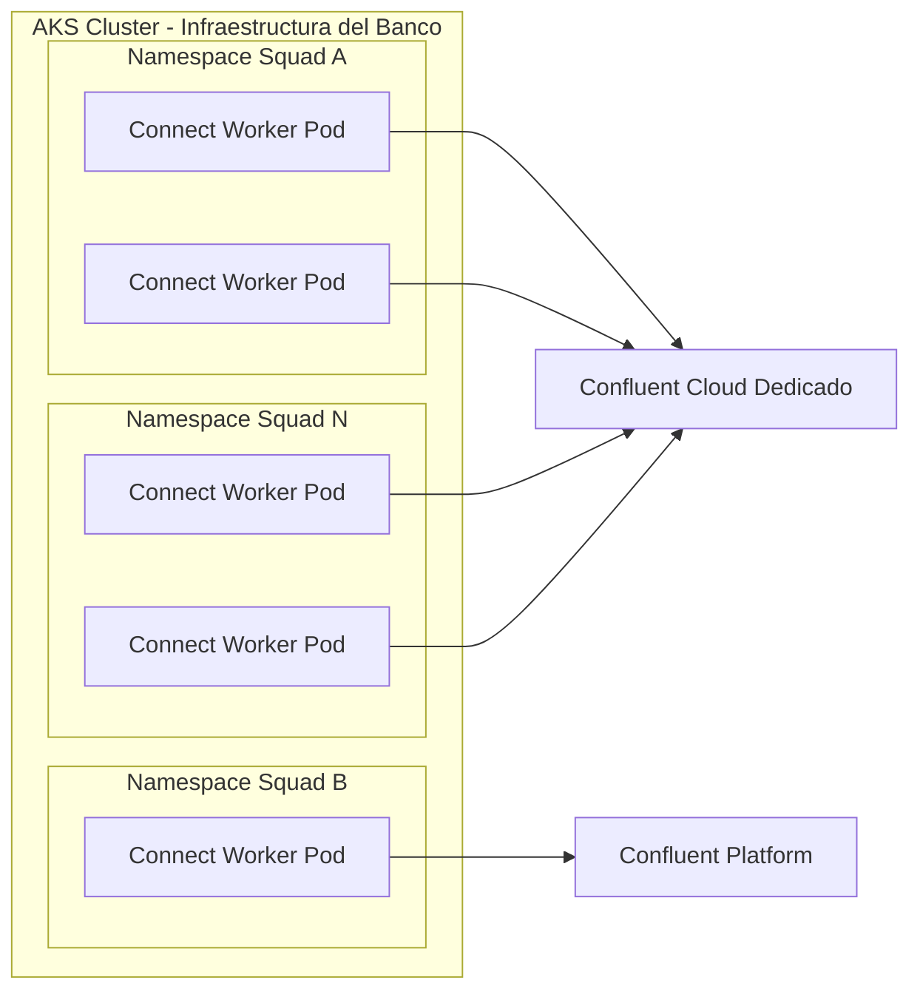
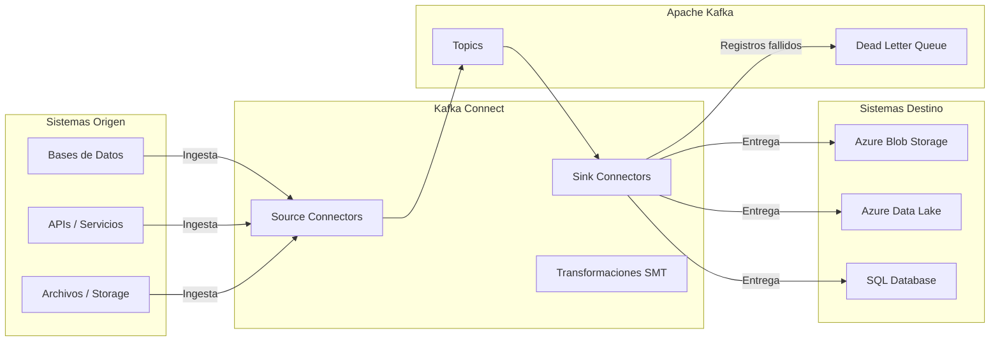
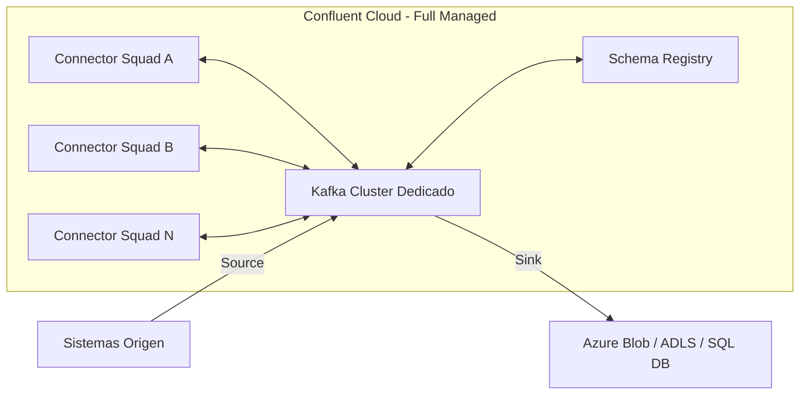
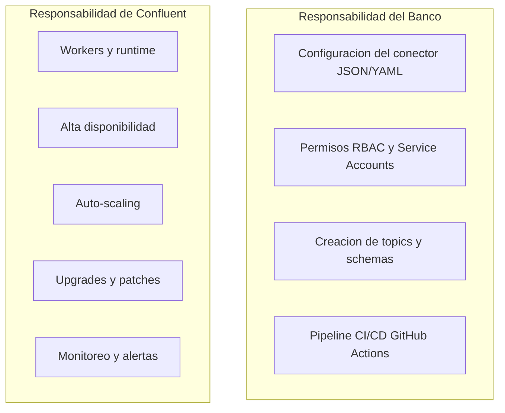
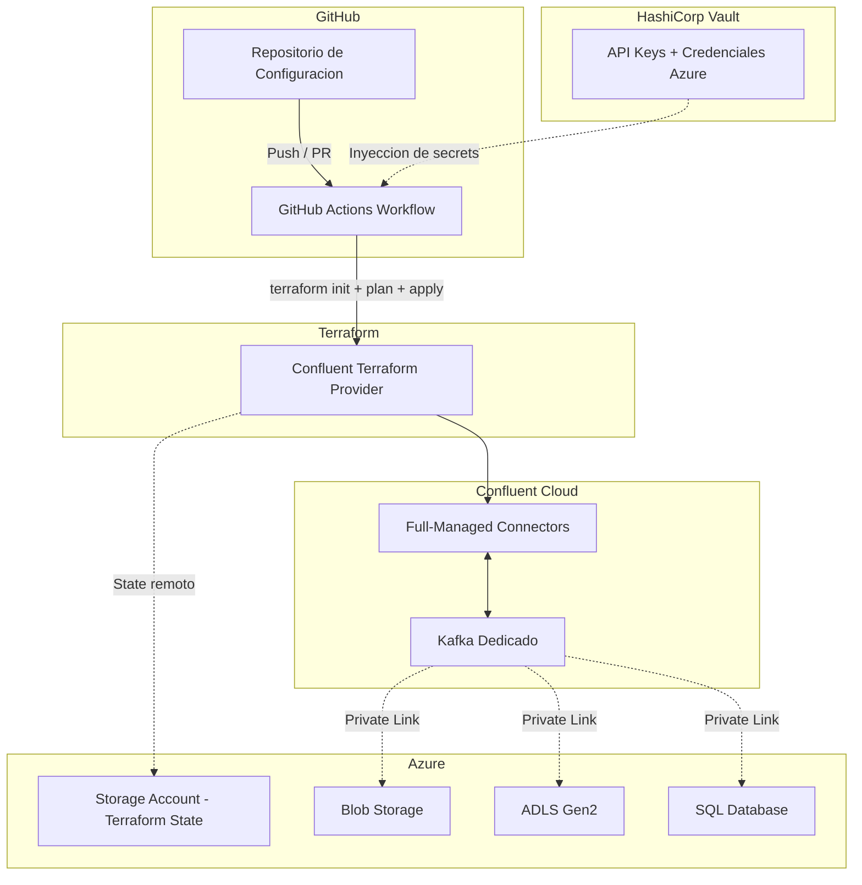
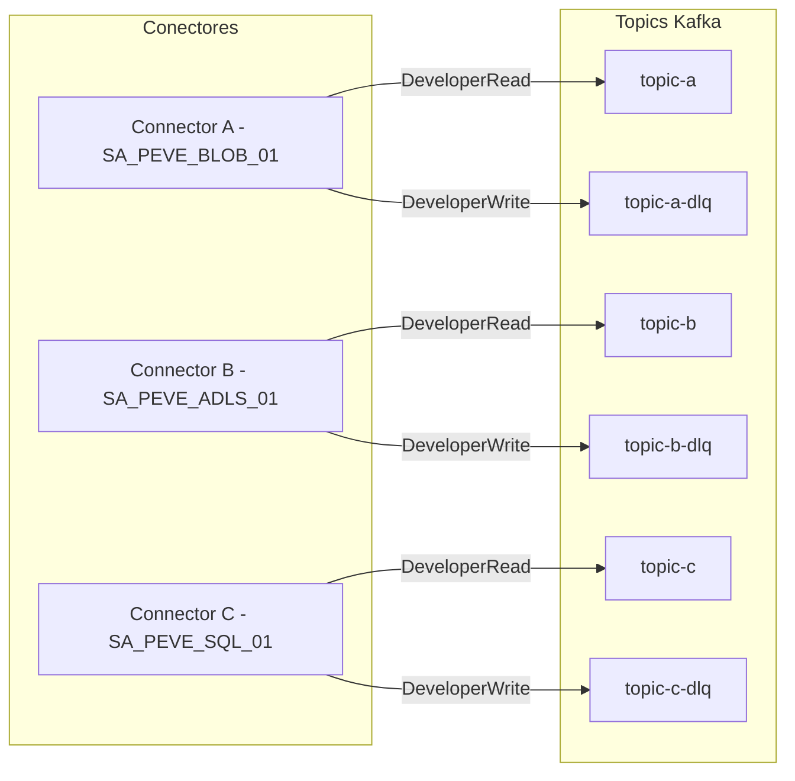
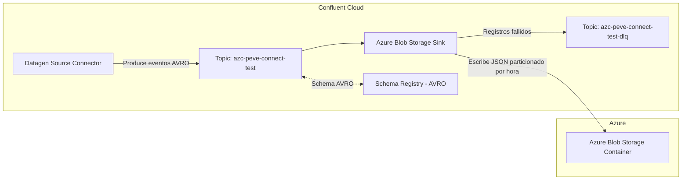

# Conectores Full-Managed en Confluent Cloud

## Menos infraestructura, mas entrega de valor

---

## Agenda

1. Contexto Actual
2. Que es Kafka Connect y Como Funciona
3. La Vision: Full-Managed Connectors
4. SaaS: Que Implica el Modelo Full-Managed
5. Donde se Despliega
6. Condiciones para Desplegarlo
7. Seguridad
8. Consideraciones Clave
9. Comparativa Self-Managed vs Full-Managed
10. Demo / Prueba de Concepto
11. Roadmap

---

## Contexto Actual — Donde estamos hoy

Los squads despliegan conectores **self-managed** en AKS (Azure Kubernetes Service), cada uno en su propio namespace, conectando a Confluent Cloud Dedicado y a Confluent Platform.

Cada equipo debe gestionar: deployments YAML, imagenes Docker, scaling, monitoreo, health checks, restarts y plugins de conectores.



### Problemas recurrentes

| Problema | Impacto |
|---|---|
| **Overhead operativo** | Los squads dedican tiempo a infraestructura en vez de logica de negocio |
| **Inconsistencia** | Cada squad configura conectores a su manera: versiones distintas, patrones diferentes |
| **Escalabilidad manual** | Ajustar tasks.max, replicas y recursos requiere intervencion manual |
| **Riesgo de disponibilidad** | Un pod caido en AKS = datos que dejan de fluir |
| **Actualizaciones complejas** | Upgrades de Kafka Connect requieren rolling updates coordinados |

---

## Que es Kafka Connect y Como Funciona

Kafka Connect es el **framework de integracion nativo** de Apache Kafka. Permite mover datos entre Kafka y sistemas externos **sin escribir codigo custom**.



### Componentes clave

- **Source Connectors** — Ingestan datos desde sistemas externos hacia Kafka (bases de datos, APIs, archivos)
- **Sink Connectors** — Envian datos desde Kafka hacia destinos (Azure Blob, Data Lake, SQL DB, etc.)
- **Tasks** — Unidades de trabajo paralelas que procesan datos concurrentemente
- **Workers** — Procesos JVM que ejecutan los tasks
- **Transformaciones (SMTs)** — Procesamiento ligero in-flight: renombrar campos, filtrar, enrutar mensajes
- **Dead Letter Queue (DLQ)** — Topic para registros que fallan, evitando que un error detenga todo el flujo

---

## La Vision — Full-Managed Connectors

Confluent Cloud ofrece **mas de 120 conectores full-managed** (pre-built, sin infraestructura). El squad solo define **QUE datos mover**, no **COMO mantener la infraestructura**.

Confluent gestiona: workers, scaling, alta disponibilidad, upgrades y monitoreo.

### Modelo: Connector-as-Configuration

Un archivo JSON + YAML define todo el conector. No hay Dockerfiles, no hay YAML de Kubernetes, no hay deployments.



### Ejemplo: Configuracion de un conector (JSON)

```json
{
    "name": "peve-azure-blob-storage-sink-connector-01",
    "config_nonsensitive": {
        "connector.class": "AzureBlobSink",
        "kafka.auth.mode": "SERVICE_ACCOUNT",
        "input.data.format": "AVRO",
        "output.data.format": "JSON",
        "time.interval": "HOURLY",
        "flush.size": "1000",
        "tasks.max": "1",
        "errors.tolerance": "all"
    }
}
```

---

## SaaS — Que Implica el Modelo Full-Managed

Confluent Cloud opera como **SaaS para integracion de datos**, eliminando la carga operativa sobre los squads.

| Caracteristica | Detalle |
|---|---|
| **Sin infraestructura** | No hay pods, namespaces AKS, ni imagenes Docker que mantener |
| **Pago por uso** | Se cobra por throughput (datos movidos), no por servidores encendidos |
| **SLA 99.95%** | Confluent garantiza disponibilidad en clusters dedicados |
| **Actualizaciones automaticas** | Patches y upgrades aplicados por Confluent sin downtime |
| **Auto-scaling** | Recursos ajustados automaticamente segun la carga |
| **Soporte enterprise** | Acceso a soporte 24/7 con expertise en Kafka |

### Responsabilidades



---

## Donde se Despliega

Los conectores full-managed corren **dentro de Confluent Cloud**, no en nuestra infraestructura. Se conectan al cluster Kafka dedicado ya existente.

### Networking hacia Azure

- **Private Link / VNet Peering** para clusters dedicados (acceso seguro a Blob Storage, ADLS, SQL DB)
- **Internet con TLS** para conectores que no requieren Private Link

### Pipeline de despliegue



### Estructura del repositorio

```
PEVE/ccloud-connectors/
  ccloud-datagen-source-connector-01/
    dev-ccloud-datagen-source-connector-01.json    # Config base (dev)
    cert-ccloud-datagen-source-connector-01.json   # Config base (cert)
    prod-ccloud-datagen-source-connector-01.json   # Config base (prod)
    dev-vars.yaml                                   # Variables entorno dev
    cert-vars.yaml                                  # Variables entorno cert
    prod-vars.yaml                                  # Variables entorno prod
  ccloud-azure-blob-storage-sink-connector-01/
    dev-ccloud-azure-blob-storage-sink-connector-01.json
    ...
```

---

## Condiciones para Desplegarlo

### Pre-requisitos

| Requisito | Estado |
|---|---|
| Cluster Kafka Dedicado en Confluent Cloud | Ya existente |
| Schema Registry | Ya existente |
| HashiCorp Vault para secrets | Ya existente |
| GitHub Actions para CI/CD | Ya existente |
| Terraform + Confluent Provider | Ya implementado |

### Requisitos por conector

- **Service Account dedicado** con permisos minimos (principio de menor privilegio)
- **RBAC configurado**: DeveloperRead/DeveloperWrite por topic, Consumer Group y Schema Registry
- **Topics pre-provisionados**: Topic fuente, topic destino y DLQ deben existir antes del despliegue
- **Schemas Avro registrados** en Schema Registry para topics que usen formato Avro
- **Networking**: Private Link hacia Azure si el destino es un recurso privado
- **Credenciales del destino** almacenadas en Vault (ej: Azure Storage Account Key)

---

## Seguridad — Modelo Zero Trust

### Un Service Account por conector

Cada conector opera con su propio Service Account. Si un SA se compromete, solo afecta a un conector.



### Capas de seguridad

| Capa | Implementacion |
|---|---|
| **Autenticacion** | kafka.auth.mode: SERVICE_ACCOUNT (sin API Keys embebidos en clusters dedicados) |
| **Autorizacion** | RBAC granular por topic, consumer group y schema subject |
| **Secrets** | Credenciales en HashiCorp Vault, inyectadas en runtime via GitHub Actions |
| **Cifrado en transito** | TLS para todas las comunicaciones (Kafka, Schema Registry, Azure) |
| **Auditoria** | Confluent Cloud registra todas las operaciones sobre conectores |
| **Resiliencia** | DLQ como safety net: registros fallidos no se pierden ni bloquean el flujo |
| **Aislamiento** | Un SA por conector, si se compromete solo afecta a un flujo de datos |

---

## Consideraciones Clave para la Migracion

### Compatibilidad

- Verificar que cada conector self-managed tiene equivalente full-managed en Confluent Cloud
- Confluent ofrece 120+ conectores pre-built: JDBC, Azure Blob, ADLS Gen2, S3, Elasticsearch, MongoDB, etc.

### Migracion de offsets

- Los offsets de conectores self-managed **no se transfieren** automaticamente al full-managed
- Estrategia de cutover recomendada:
  1. Pausar el conector self-managed
  2. Desplegar el conector full-managed con `scan.startup.mode` apropiado
  3. Validar que el flujo opera correctamente
  4. Eliminar el conector self-managed

### Lifecycle management en Terraform

| Accion | Resultado | Offsets |
|---|---|---|
| Cambiar configuracion (tasks.max, flush.size, etc.) | Update in-place | Se conservan |
| Cambiar status (RUNNING/PAUSED) | Update in-place | Se conservan |
| Cambiar nombre del conector | Destroy + Create | Se pierden |
| Renombrar directorio de configuracion | Destroy + Create | Se pierden |

Se implementaron **precondiciones en Terraform** para prevenir cambios accidentales de nombre que causen perdida de offsets.

### Limites

- Max 50 conectores por cluster (ampliable con soporte)
- Max 10 tasks por conector (ampliable con soporte)
- Throughput dependiente del plan contratado

---

## Comparativa: Self-Managed vs Full-Managed

| Aspecto | Self-Managed (AKS) | Full-Managed (Confluent Cloud) |
|---|---|---|
| **Infraestructura** | Gestionada por el squad (pods, Docker, AKS) | Gestionada por Confluent |
| **Scaling** | Manual (replicas, CPU/memory requests) | Automatico |
| **Upgrades** | Rolling update manual, coordinado | Automatico, sin downtime |
| **Alta disponibilidad** | Depende de config AKS y anti-affinity | Garantizada por Confluent (SLA 99.95%) |
| **Time to deploy** | Dias (Dockerfile, K8s YAML, Helm, config) | Minutos (JSON + terraform apply) |
| **Monitoreo** | Custom (Prometheus + Grafana + alertas) | Built-in en Confluent Cloud Console |
| **Costo operativo** | Alto (DevOps + SRE + infra AKS) | Bajo (solo configuracion) |
| **Seguridad** | Gestion manual de secrets y networking | RBAC nativo + Vault + Service Accounts |
| **Plugins** | Requiere construir imagen custom | 120+ conectores pre-built |
| **DLQ** | Configuracion manual | Generacion automatica desde Terraform |
| **CI/CD** | Pipeline custom por squad | Pipeline estandarizado para todos los squads |

---

## Demo / Prueba de Concepto

### Lo que ya construimos

Pipeline funcional end-to-end con 2 conectores desplegados via Terraform + GitHub Actions:



### Caracteristicas implementadas

- Despliegue automatizado via **GitHub Actions + Terraform**
- Configuracion **100% declarativa** (JSON + YAML por entorno: dev, cert, prod)
- **DLQ configurado automaticamente** desde la configuracion del conector
- **Service Account por conector** con RBAC granular
- **Terraform state remoto** en Azure Storage Account
- **Precondiciones de lifecycle** para prevenir destruccion accidental de conectores
- **Resolucion automatica de Service Accounts** por nombre (Terraform data source)

---

## Roadmap — Como Continuamos

### Fase 1: Validacion (Sprint actual)

- Completar la POC con Datagen Source + Azure Blob Storage Sink
- Validar el pipeline CI/CD end-to-end en entorno de desarrollo
- Documentar runbooks de operacion (pause, resume, troubleshooting)

### Fase 2: Piloto (Proximo sprint)

- Seleccionar un squad piloto con un conector self-managed de bajo riesgo (sink)
- Migrar el conector a full-managed
- Configurar Private Link entre Confluent Cloud y Azure VNet
- Medir y comparar: tiempo de despliegue, estabilidad, costos

### Fase 3: Escalamiento

- Capacitar squads en el modelo Connector-as-Configuration
- Migrar conectores progresivamente (sinks primero, luego sources)
- Establecer estandares y plantillas de conectores para el banco
- Descomisionar namespaces de Kafka Connect en AKS conforme se migran

### Fase 4: Operacion continua

- Monitoreo centralizado desde Confluent Cloud Console
- Alertas automatizadas para conectores fallidos o degradados
- Gestion de conectores 100% via Git + Terraform (GitOps)

---

## Resumen Ejecutivo

| Dimension | Beneficio |
|---|---|
| **Operaciones** | Eliminamos la gestion de pods, Docker y AKS para conectores |
| **Velocidad** | De dias a minutos para desplegar un nuevo conector |
| **Consistencia** | Un solo patron estandarizado para todos los squads |
| **Seguridad** | Zero Trust: SA por conector, RBAC granular, secrets en Vault |
| **Costos** | Reduccion de TCO: menos infra AKS + menos horas DevOps/SRE |
| **Resiliencia** | Alta disponibilidad garantizada + DLQ para registros fallidos |
| **Escalabilidad** | Auto-scaling sin intervencion manual |

**El squad se enfoca en definir QUE datos mover. Confluent se encarga del COMO.**
