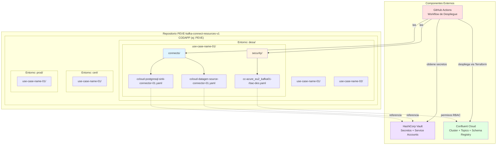
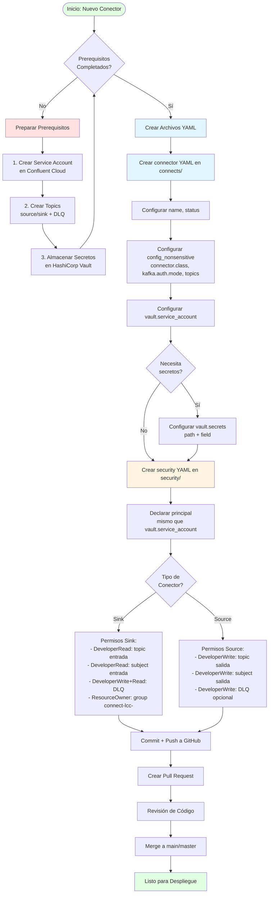
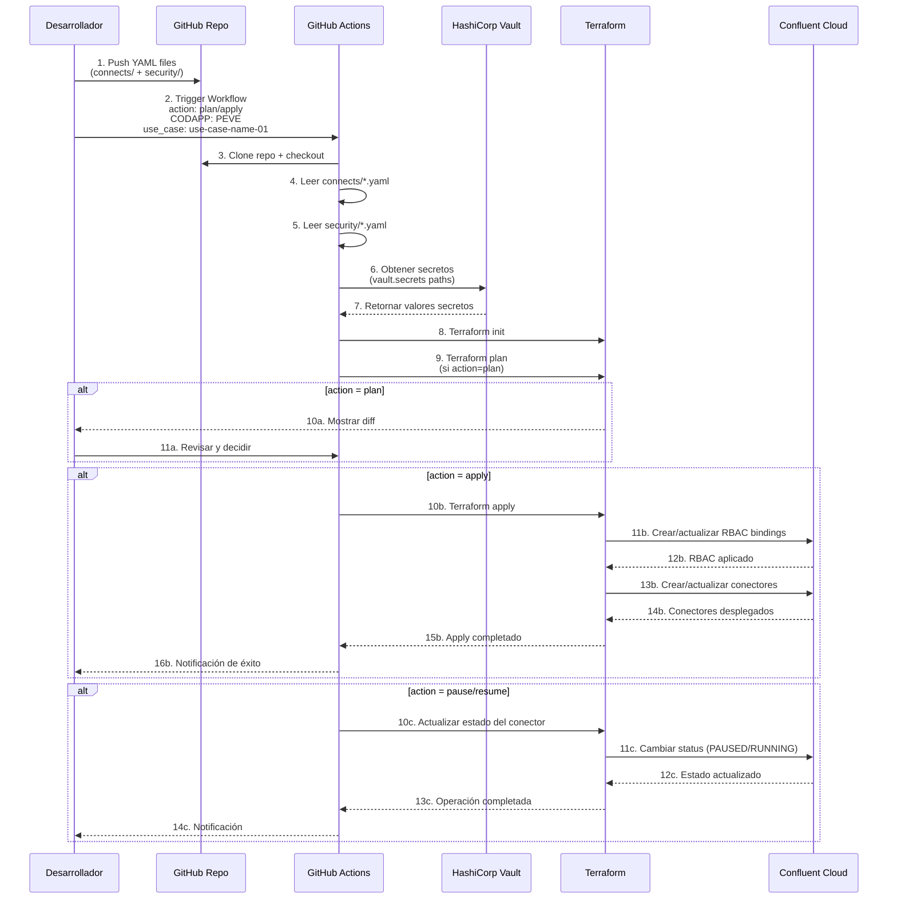
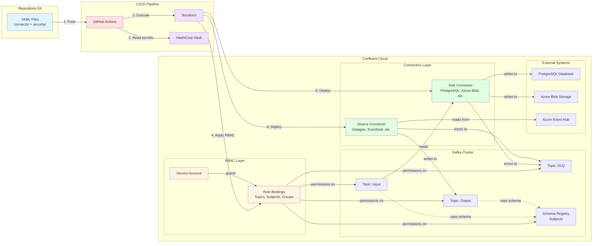
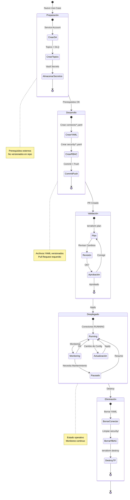

# Modelo operativo — conectores full-managed

Contrato para que una aplicación (**CODAPP**) declare conectores Kafka Connect full-managed en YAML, agrupados por **caso de uso**, y pida el despliegue con el workflow de GitHub Actions.

El YAML vive en el repositorio externo `PEVE-kafka-connect-resources-v1` (`{CODAPP}/desa|{cert}|{prod}/{use-case}/`). El workflow (en el repo de automatización) lo clona a `./externo`, igual que statements Flink.

> **Alcance**: Confluent Cloud Dedicated (RBAC, no ACLs). El workflow actual despliega **solo DES** (`desa`). Las carpetas `cert/` y `prod/` se versionan para cuando existan los workflows de esos entornos.

## Tabla de Contenidos

1. [Diagramas de Arquitectura y Flujo](#diagramas-de-arquitectura-y-flujo)
2. [Qué hace el equipo de la aplicación](#qué-hace-el-equipo-de-la-aplicación)
3. [Permisos RBAC Requeridos](#permisos-rbac-requeridos)
4. [Unidad de despliegue: el caso de uso](#unidad-de-despliegue-el-caso-de-uso)
5. [Estructura de directorios](#estructura-de-directorios)
6. [YAML del conector](#yaml-del-conector-connects)
7. [YAML de RBAC](#yaml-de-rbac-security)
8. [Nomenclatura](#nomenclatura)
9. [Ciclo de vida](#ciclo-de-vida)
10. [Reglas que evitan recrear el conector](#reglas-que-evitan-recrear-el-conector)
11. [Cómo disparar el workflow](#cómo-disparar-el-workflow)
12. [Troubleshooting](#troubleshooting)
13. [Referencias](#referencias)

---

## Diagramas de Arquitectura y Flujo

### 1. Estructura de Repositorio y Componentes



### 2. Flujo de Configuración de un Conector



### 3. Flujo de Despliegue via GitHub Actions



### 4. Arquitectura de Conectores en Confluent Cloud



### 5. Ciclo de Vida de un Use-Case



---

## Qué hace el equipo de la aplicación

1. **Prerrequisito: Service Account** del conector (alta aparte; el SA queda en HashiCorp Vault).
2. Topics (y DLQ si aplica) ya creados en el cluster.
3. Carpeta `{CODAPP}/{desa|cert|prod}/{use-case}/` con `connects/` y `security/`.
4. Pull request. Despliegue con **Run workflow**.

La aplicación versiona YAML. No interviene en cómo plataforma aplica el cambio.

### Prerrequisitos que no salen de este repo

| Qué | Quién |
|---|---|
| Service Account del conector | Proceso de alta (el nombre va en `vault.service_account`) |
| Topics de origen/destino | Ya deben existir |
| Topic DLQ `{topic}-dlq` | Ya debe existir si el YAML tiene `errors.tolerance` |
| Secretos (keys, passwords) | HashiCorp Vault; el YAML solo declara `path` y `field` |

---

## Permisos RBAC Requeridos

Los conectores full-managed de Confluent Cloud **requieren permisos RBAC** en los topics que utilizan (source, sink y DLQ). Estos permisos se otorgan al **Service Account** del conector **antes** (o en el mismo `apply`) del despliegue.

El RBAC **no** va en el YAML del conector (`connects/`). Se declara en archivos YAML dentro de `{CODAPP}/{desa|cert|prod}/{use-case}/security/*.yaml`.

### Formato de Declaración RBAC

Los permisos RBAC se declaran en archivos YAML con la siguiente estructura:

```yaml
cluster:
  cc:
    properties:
      - name: "azure_eu2_kafka01"
    rbac:
    - principal: SA_NOMBRE_SERVICE_ACCOUNT
      resources:
      - resource_type: [topic|subject|group|transactional-id]
        resource_name: 'nombre-del-recurso'
        pattern_type: [LITERAL|PREFIXED]
        role:
        - operation: [DeveloperRead|DeveloperWrite|DeveloperManage|ResourceOwner]
```

| Campo | Descripción |
|-------|-------------|
| `principal` | Display name del Service Account (debe coincidir con `vault.service_account` del conector) |
| `resource_type` | Tipo de recurso: `topic`, `subject`, `group`, `transactional-id` |
| `resource_name` | Nombre del recurso (topic, subject, consumer group, etc.) |
| `pattern_type` | `LITERAL` (nombre exacto) o `PREFIXED` (prefijo del nombre) |
| `operation` | Operación RBAC permitida: `DeveloperRead`, `DeveloperWrite`, `DeveloperManage`, `ResourceOwner` |

### Permisos para Conectores Sink

Los sink connectors (ej: PostgresSink, AzureBlobStorageSink) requieren:

| Recurso | Operación Requerida | Descripción |
|---------|---------------------|-------------|
| **Topic de entrada** (`topics`) | `DeveloperRead` | Leer mensajes del topic de entrada |
| **Subject de entrada** (Schema Registry) | `DeveloperRead` | Leer el schema Avro del topic de entrada |
| **Topic DLQ** (`[topic]-dlq`) | `DeveloperWrite` + `DeveloperRead` | Escribir mensajes fallidos al DLQ |
| **Consumer Group** (`connect-lcc-`) | `ResourceOwner` (PREFIXED) | Gestionar el consumer group del conector |

**Ejemplo completo para Sink Connector:**

```yaml
cluster:
  cc:
    properties:
      - name: "azure_eu2_kafka01"
    rbac:
    - principal: SA_AZC_DES_PEVE_PGSNK_01
      resources:
      # Schema Registry - lectura del schema del topic de entrada
      - resource_type: subject
        resource_name: 'azc-peve-transaction-value'
        pattern_type: LITERAL
        role:
        - operation: DeveloperRead
      # Topic de entrada - lectura de mensajes
      - resource_type: topic
        resource_name: 'azc-peve-transaction'
        pattern_type: LITERAL
        role:
        - operation: DeveloperRead
      # Topic DLQ - escritura de mensajes fallidos
      - resource_type: topic
        resource_name: 'azc-peve-transaction-dlq'
        pattern_type: LITERAL
        role:
        - operation: DeveloperWrite
        - operation: DeveloperRead
      # Consumer Group - requerido para todos los sink connectors
      - resource_type: group
        resource_name: 'connect-lcc-'
        pattern_type: PREFIXED
        role:
        - operation: ResourceOwner
```

### Permisos para Conectores Source

Los source connectors (ej: DatagenSource, AzureEventHubsSource) requieren:

| Recurso | Operación Requerida | Descripción |
|---------|---------------------|-------------|
| **Topic de salida** (`kafka.topic`) | `DeveloperWrite` | Escribir mensajes al topic de salida |
| **Subject de salida** (Schema Registry) | `DeveloperWrite` | Registrar el schema Avro del topic de salida |
| **Topic DLQ** (`[topic]-dlq`) | `DeveloperWrite` | Escribir mensajes fallidos al DLQ (si aplica) |

**Ejemplo completo para Source Connector:**

```yaml
cluster:
  cc:
    properties:
      - name: "azure_eu2_kafka01"
    rbac:
    - principal: SA_AZC_DES_PEVE_DATAGEN_01
      resources:
      # Schema Registry - escritura del schema del topic de salida
      - resource_type: subject
        resource_name: 'azc-peve-transaction-value'
        pattern_type: LITERAL
        role:
        - operation: DeveloperWrite
      # Topic de salida - escritura de mensajes
      - resource_type: topic
        resource_name: 'azc-peve-transaction'
        pattern_type: LITERAL
        role:
        - operation: DeveloperWrite
```

### Resumen de Operaciones RBAC

| Operación | Permisos | Uso Recomendado |
|-----------|----------|-----------------|
| `ResourceOwner` | Lectura y escritura completas | Para consumer groups (`connect-lcc-`) en sink connectors |
| `DeveloperRead` | Solo lectura | Para topics de entrada y subjects en sinks |
| `DeveloperWrite` | Solo escritura | Para topics de salida, DLQ y subjects en sources |
| `DeveloperManage` | Gestión de recursos | Para operaciones avanzadas de administración |

### Permisos de Schema Registry

Los conectores que utilizan schemas Avro (configurados con `input.data.format: "AVRO"` o `output.data.format: "AVRO"`) necesitan permisos en **subjects** de Schema Registry:

1. **Leer schemas existentes** de los topics de entrada (sinks): `DeveloperRead` en el subject
2. **Registrar nuevos schemas** cuando escriben a topics de salida o DLQ (sources): `DeveloperWrite` en el subject
3. **Gestionar versiones de schemas** para los subjects correspondientes a los topics

**Formato del subject**: `{topic-name}-value` (ej: `azc-peve-transaction-value`)

> **Nota**: Los permisos de Schema Registry se declaran a nivel de **subject individual**, no a nivel de environment. Cada topic tiene su propio subject que debe declararse explícitamente en el YAML de seguridad.

### Service Account y Autenticación

Cada conector utiliza el Service Account configurado en la sección `vault` del YAML:

```yaml
vault:
  service_account: "SA_AZC_DES_PEVE_PGSNK_01"
  secrets:
    connection.password:
      path: "peve/data/dev/peve/postgresql/DB_PEVE_CONNECT_DEV"
      field: "password"
```

El `service_account` especificado aquí es el que Terraform inyecta automáticamente como `kafka.service.account.id` en la configuración del conector.

**⚠️ IMPORTANTE**: 
- Los permisos RBAC se declaran en el archivo `security/*.yaml` del mismo use-case antes del despliegue
- **NO** se configuran en el YAML del conector
- El `principal` en `security/*.yaml` debe coincidir exactamente con `vault.service_account`
- No se requiere API Key adicional - Confluent Cloud gestiona la autenticación automáticamente con `kafka.auth.mode: "SERVICE_ACCOUNT"`

### Permisos para Dead Letter Queue (DLQ)

Cuando un conector tiene `errors.tolerance: "all"` configurado, el sistema asigna automáticamente:
- `errors.deadletterqueue.topic.name = {primer-topic}-dlq`

**El topic DLQ debe ser creado manualmente** antes del despliegue (Terraform no lo crea automáticamente).

**Permisos típicos para DLQ en Sink Connectors:**
```yaml
- resource_type: topic
  resource_name: 'azc-peve-transaction-dlq'
  pattern_type: LITERAL
  role:
  - operation: DeveloperWrite
  - operation: DeveloperRead
```

**Permisos típicos para DLQ en Source Connectors (si el conector lo soporta):**
```yaml
- resource_type: topic
  resource_name: 'azc-peve-transaction-dlq'
  pattern_type: LITERAL
  role:
  - operation: DeveloperWrite
```

> **Nota**: `DeveloperRead` en el DLQ es útil para monitoreo pero no es estrictamente necesario. `DeveloperWrite` es obligatorio para que el conector pueda enviar mensajes fallidos al DLQ.

### Consumer Groups en Sink Connectors

Los sink connectors crean automáticamente un consumer group con el formato `connect-lcc-{connector-id}`. Por eso necesitan el permiso `ResourceOwner` PREFIXED en `connect-lcc-` para poder:
- Leer mensajes (READ)
- Describir el grupo (DESCRIBE)
- Gestionar offsets (DELETE)

### Verificación de Permisos RBAC

Para verificar que el Service Account tiene los permisos RBAC correctos usando el CLI de Confluent:

```bash
# Listar role bindings del Service Account
confluent iam rbac role-binding list \
  --principal User:sa-xxxxx \
  --environment env-xxxxx
```

Deberías ver entradas como:
```
Principal      | Role          | Resource Type | Resource Name               | Pattern Type
User:sa-xxxxx  | DeveloperRead | Topic         | azc-peve-transaction        | LITERAL
User:sa-xxxxx  | DeveloperWrite| Topic         | azc-peve-transaction-dlq    | LITERAL
User:sa-xxxxx  | ResourceOwner | Group         | connect-lcc-                | PREFIXED
```

### Checklist de Permisos RBAC

Antes de desplegar un conector, verifica:

**Para Sink Connectors:**
- [ ] `DeveloperRead` en subject del topic de entrada (`{topic-name}-value`)
- [ ] `DeveloperRead` en topic de entrada
- [ ] `DeveloperWrite` + `DeveloperRead` en topic DLQ (`{topic-name}-dlq`)
- [ ] `ResourceOwner` PREFIXED en consumer group (`connect-lcc-`)

**Para Source Connectors:**
- [ ] `DeveloperWrite` en subject del topic de salida (`{topic-name}-value`)
- [ ] `DeveloperWrite` en topic de salida
- [ ] `DeveloperWrite` en topic DLQ (si el conector lo soporta)

**Validación:**
- [ ] El `principal` en `security/*.yaml` coincide exactamente con `vault.service_account` del conector
- [ ] Los nombres de topics en el YAML de seguridad coinciden con los del YAML del conector
- [ ] La carpeta `security/` existe (incluso si está vacía)

---

## Unidad de despliegue: el caso de uso

**`plan`, `apply` y `destroy` son por use-case**, no por conector.

Con **CODAPP** + **use_case** basta. El workflow toma **todos** los `*.yaml` de `connects/` y el RBAC de `security/` de esa carpeta.

El input **connector** es **obligatorio solo en `pause` y `resume`**. En `plan` / `apply` / `destroy` se ignora.

| Acción | Inputs | Efecto |
|---|---|---|
| `plan` | `CODAPP`, `use_case` | Muestra el diff de **todos** los conectores y el RBAC del use-case |
| `apply` | `CODAPP`, `use_case` | Crea, actualiza o borra según los YAML de `connects/` y `security/` |
| `destroy` | `CODAPP`, `use_case` | Elimina **todo** el use-case (conectores y bindings de ese módulo) |
| `pause` | `CODAPP`, `use_case`, **`connector`** | Pausa **un** conector (in-place). Los demás no se tocan |
| `resume` | `CODAPP`, `use_case`, **`connector`** | Reanuda **un** conector |

`connector` = nombre del archivo en `connects/` **sin** `.yaml` (ej. `ccloud-azure-blob-storage-sink-connector-01`).

---

## Estructura de directorios

```
{CODAPP}/
├── desa/
│   └── {use-case}/
│       ├── connects/
│       │   └── {connector-name}.yaml     # un YAML por conector
│       └── security/
│           └── cc-azure_eu2_kafka01-rbac-des.yaml
├── cert/
│   └── {use-case}/
│       ├── connects/
│       └── security/
└── prod/
    └── {use-case}/
        ├── connects/
        └── security/
```

| Pieza | Ruta |
|---|---|
| Conectores | `{CODAPP}/{desa\|cert\|prod}/{use-case}/connects/*.yaml` |
| RBAC | `{CODAPP}/{desa\|cert\|prod}/{use-case}/security/*.yaml` |

- Entornos en minúsculas: `desa`, `cert`, `prod`. El directorio **es** el entorno; **no** uses prefijo `dev-` / `cert-` / `prod-` en el nombre del archivo.
- Solo `*.yaml` (no `*.yml`, no subcarpetas).
- `{use-case}` es el valor del input `use_case` (ej. `use-case-name-01`).
- `security/` es **obligatorio** (el directorio debe existir). Si el use-case no tiene bindings aún, deja la carpeta y añade YAML cuando correspondan.
- Ejemplo: `PEVE/desa/use-case-name-01/`.

---

## YAML del conector (`connects/`)

Un archivo por conector. Config no sensible + referencia a Vault. **No commitear secretos.**

```yaml
name: "peve-azure-blob-storage-sink-connector-01"
status: "RUNNING"   # RUNNING | PAUSED

config_nonsensitive:
  name: "peve-azure-blob-storage-sink-connector-01"
  connector.class: "AzureBlobSink"
  kafka.auth.mode: "SERVICE_ACCOUNT"
  tasks.max: "1"
  errors.tolerance: "all"
  topics: "azc-peve-connect-test"
  # resto de propiedades del conector (sin credenciales)

vault:
  service_account: "SA_AZC_DES_PEVE_BLOB_01"
  secrets:
    azblob.account.key:
      path: "peve/data/dev/peve/azure/ST_PEVE_CONNECT_DEV"
      field: "access_key"
```

| Campo | Rol |
|---|---|
| Nombre del **archivo** | Key de Terraform (`for_each`). No es un índice de lista. No lo cambies después del primer `apply` |
| `name` / `config_nonsensitive.name` | Nombre en Confluent Cloud. Tampoco lo cambies después del primer `apply` |
| `status` | `RUNNING` o `PAUSED`. Fuente de verdad en el próximo `apply` |
| `config_nonsensitive` | Propiedades del conector. `kafka.service.account.id` se inyecta desde `vault.service_account` |
| `vault.service_account` | Display name del SA (debe existir). Kafka y Schema Registry usan **este mismo** SA |
| `vault.secrets` | Mapa `config_key → { path, field }` en Vault. El workflow los lee e inyecta como `config_sensitive` |

Si hay `errors.tolerance` y un topic (`topics` o `kafka.topic`), el módulo asigna `errors.deadletterqueue.topic.name` = `{primer-topic}-dlq`. Ese topic tiene que existir de antemano.

Path de Vault: se admite `{mount}/data/...`; el workflow lo traduce a `{mount}/kv2/data/...` si hace falta.

---

## YAML de RBAC (`security/`)

YAML `cluster.cc.rbac` en `security/`. El módulo aplica **topic**, **subject**, **group** y **transactional-id** al SA del conector.

El `principal` debe coincidir con `vault.service_account` del conector. Un **sink** necesita `ResourceOwner` PREFIXED en `connect-lcc-` (consumer group `connect-lcc-<id>`: READ, DESCRIBE, DELETE). Un source (Datagen) no.

```yaml
cluster:
  cc:
    properties:
      - name: "azure_eu2_kafka01"
    rbac:
    - principal: SA_AZC_DES_PEVE_BLOB_01
      resources:
      - resource_type: subject
        resource_name: 'azc-peve-connect-test-value'
        pattern_type: LITERAL
        role:
        - operation: DeveloperRead
      - resource_type: topic
        resource_name: 'azc-peve-connect-test'
        pattern_type: LITERAL
        role:
        - operation: DeveloperRead
      - resource_type: topic
        resource_name: 'azc-peve-connect-test-dlq'
        pattern_type: LITERAL
        role:
        - operation: DeveloperWrite
        - operation: DeveloperRead
      - resource_type: group
        resource_name: 'connect-lcc-'
        pattern_type: PREFIXED
        role:
        - operation: ResourceOwner
```

Ver la sección [Permisos RBAC Requeridos](#permisos-rbac-requeridos) para más detalles sobre los permisos necesarios según el tipo de conector.

Borrar un YAML de `connects/` **no** quita estos bindings. Hay que editar o borrar el YAML de `security/` y hacer `apply`.

---

## Nomenclatura

| Qué | Formato | Ejemplo |
|---|---|---|
| CODAPP | 4 letras | `PEVE` |
| Use-case (carpeta e input) | kebab-case estable | `use-case-name-01` |
| Archivo del conector | `ccloud-{tipo}-{secuencia}.yaml` | `ccloud-azure-blob-storage-sink-connector-01.yaml` |
| `name` en Cloud | sin prefijo de entorno | `peve-azure-blob-storage-sink-connector-01` |
| Service Account | el que entregue el alta | `SA_AZC_DES_PEVE_BLOB_01` |
| `status` | `RUNNING` o `PAUSED` | `RUNNING` |

---

## Ciclo de vida

### Alta (nuevo conector o use-case nuevo)

1. SA, topics y DLQ listos; secretos en Vault.
2. Crear `{use-case}/connects/{connector}.yaml` y bindings en `security/`.
3. Workflow: `action: plan`, luego `apply`, con `CODAPP` y `use_case`.

### Cambio de configuración

1. Editar el YAML en `connects/` (o `security/`).
2. `plan` + `apply` del mismo `use_case`.

### Agregar un conector a un use-case que ya está desplegado

1. Añade un YAML nuevo en `connects/` (nombre de archivo **nuevo**).
2. Completa RBAC en `security/` si aplica.
3. `apply` del mismo `use_case`.

Terraform crea **solo** el nuevo. Los demás no se recrean ni pierden offsets.

### Quitar un conector del use-case

1. Borra **ese** YAML de `connects/` (no renombres: borra).
2. Quita las entradas de `security/` que ya no apliquen.
3. `apply` del mismo `use_case`.

Se destruye **solo** ese conector. Los otros siguen.

No vacíes `connects/` para “limpiar”: un `apply` sin YAML se **bloquea**. Para borrar el use-case entero usa `destroy`.

### Pausar / reanudar un conector

**Desde el Action (operación puntual):**

1. `action: pause` o `resume`.
2. Mismo `CODAPP` + `use_case`.
3. **`connector`**: nombre del archivo sin `.yaml`.

Eso no modifica el YAML. El próximo **`apply` vuelve al `status` del archivo**. Si el pause debe quedar fijo, pon `status: "PAUSED"` en el YAML y haz `apply`.

**Desde Git (estado permanente):** cambia `status` en el YAML y `apply`.

### Borrar el use-case entero

`action: destroy` con `CODAPP` + `use_case`. Elimina conectores y RBAC de ese módulo.

---

## Reglas que evitan recrear el conector

| Hacer | No hacer |
|---|---|
| Agregar un YAML con **nombre de archivo nuevo** | Renombrar un YAML ya aplicado |
| Borrar el YAML para dar de baja | Cambiar `name` / `config_nonsensitive.name` después del primer apply |
| Editar propiedades dentro del mismo archivo | Vaciar `connects/` y hacer `apply` |

Renombrar el archivo o el `name` cambia la key de Terraform: destruye el conector viejo, crea uno nuevo y **se pierden los offsets**.

---

## Cómo disparar el workflow

1. Actions → el workflow de conectores → **Run workflow**.
2. Rellenar:

| Input | `plan` / `apply` / `destroy` | `pause` / `resume` |
|---|---|---|
| `action` | la acción | `pause` o `resume` |
| `CODAPP` | sí | sí |
| `use_case` | sí (carpeta del caso de uso) | sí |
| `connector` | no (se ignora) | **obligatorio** |

Hoy el workflow apunta a **DES** (`{CODAPP}/desa/{use_case}/`).

---

## Troubleshooting

**`connects/` no existe o sin YAML**  
El `apply` se bloquea a propósito: un directorio vacío destruiría todos los conectores del use-case. Añade al menos un YAML o usa `destroy`.

**`security/` no existe**  
El job falla. No se “omite” RBAC en silencio (un for_each vacío borraría los bindings). Crea la carpeta.

**pause/resume: falta `connector` o no existe el YAML**  
El input debe ser el basename de un archivo en `connects/` de ese use-case.

**El conector pausado volvió a RUNNING**  
El `apply` restauró el `status` del YAML. Deja `status: "PAUSED"` en el archivo si debe persistir.

**Credenciales rechazadas (Azure, SQL, etc.)**  
Revisa `vault.secrets` (`path` + `field`). No pongas el secreto en el YAML.

**RBAC / DLQ**  
El SA necesita Read en el topic (sink) o Write (source), y Write en `{topic}-dlq`. Un sink además necesita `ResourceOwner` PREFIXED en `group` `connect-lcc-`. Ver la sección [Permisos RBAC Requeridos](#permisos-rbac-requeridos).

**Failed: insufficient permissions on the consumer group (`connect-lcc-*`)**  
Falta el binding `group` / `connect-lcc-` en `security/`, o el módulo Terraform aún no materializa `resource_type: group`. Publica `rbac.tf` y el YAML de `security/`, luego `apply`. Si el conector sigue Failed, `resume` o recrea.

---

## Referencias

- [Confluent Cloud Connectors](https://docs.confluent.io/cloud/current/connectors/index.html)
- [Terraform `confluent_connector`](https://registry.terraform.io/providers/confluentinc/confluent/latest/docs/resources/connector)
- [Confluent Cloud RBAC](https://docs.confluent.io/cloud/current/security/access-control/rbac/overview.html)

## Changelog

- **2026-08-25**: Integración completa de permisos RBAC en el documento principal. Agregados diagramas de arquitectura y flujo.
- **2026-08-20**: Modelo por use-case (`connects/` + `security/`). Despliegue por `use_case`; `pause`/`resume` por conector. Se retira el layout `ccloud-connectors/{connector}/{env}-*.json`.
